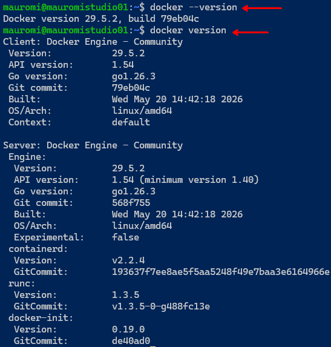
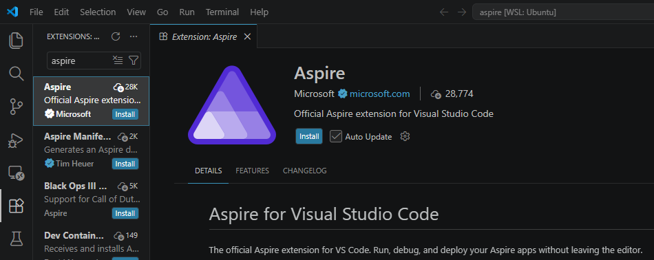

# 1. Prerequisites

Before running through this quickstart, make sure the following are installed and
working. The environment used throughout the guide is **Ubuntu 24.04 on WSL**.

## Table of contents

- [Install the .NET SDK or .NET Runtime (Ubuntu 24.04)](#install-the-net-sdk-or-net-runtime-ubuntu-2404)
- [Troubleshooting: when APT and the Microsoft SDK don't "see" each other](#troubleshooting-when-apt-and-the-microsoft-sdk-dont-see-each-other)
- [Install an OCI‑compliant container runtime](#install-an-ocicompliant-container-runtime)
- [Install an IDE](#install-an-ide)

---

## Install the .NET SDK or .NET Runtime (Ubuntu 24.04)

See the official guide:
[Install .NET on Ubuntu](https://learn.microsoft.com/en-us/dotnet/core/install/linux-ubuntu-install?tabs=dotnet10&pivots=os-linux-ubuntu-2404).

**Install:**

```bash
sudo apt-get install -y aspnetcore-runtime-10.0
```

**Verify** the runtimes and SDKs are visible:

```bash
dotnet --list-runtimes
dotnet --list-sdks
```

Example output:

```text
$ dotnet --list-runtimes
Microsoft.AspNetCore.App 10.0.10 [/usr/lib/dotnet/shared/Microsoft.AspNetCore.App]
Microsoft.NETCore.App    10.0.10 [/usr/lib/dotnet/shared/Microsoft.NETCore.App]

$ dotnet --list-sdks
10.0.110 [/usr/lib/dotnet/sdk]
```

---

## Troubleshooting: when APT and the Microsoft SDK don't "see" each other

**Why this happens:**

- APT installs .NET into `/usr/lib/dotnet`.
- The Microsoft SDK installer installs into `~/.dotnet`.
- The `dotnet` binary uses **only** the directory where the binary itself lives.

So if your `dotnet` is the one in `~/.dotnet`, it completely ignores
`/usr/lib/dotnet` (and vice versa). The fix is to point everything at the
system‑wide install and enable multilevel lookup.

| Step | Command / action | Notes |
|------|------------------|-------|
| **1️⃣ Open `~/.profile`** | `nano ~/.profile` | |
| **2️⃣ Add these lines at the end** | see block below | Use `dotnet` system‑wide and enable multilevel lookup |
| **3️⃣ Remove any line in `.bashrc` that adds `~/.dotnet` to `PATH`** | `nano ~/.bashrc` — remove `export PATH=$HOME/.dotnet:$PATH` | |
| **4️⃣ Fully shut down WSL** | in PowerShell: `wsl --shutdown` | `source` is **not** enough — close the terminal window first |
| **5️⃣ Reopen WSL and verify** | `which dotnet` · `dotnet --list-runtimes` | |

Lines to add to `~/.profile` (step 2):

```bash
# Use dotnet system-wide
export PATH=/usr/bin:$PATH
export DOTNET_ROOT=/usr/lib/dotnet
# Enable multilevel lookup
export DOTNET_MULTILEVEL_LOOKUP=1
```

After reopening WSL, the verification looks like this:


---

## Install an OCI‑compliant container runtime

Aspire needs a container runtime to build and run containers (used later for the
Python service and for both deployment targets). Install **Docker** (or another
OCI‑compliant runtime such as Podman).



---

## Install an IDE

Aspire supports multiple IDEs and code editors — choose the one that best fits your
workflow.

**Visual Studio Code** is recommended for the best experience: a lightweight,
cross‑platform editor with excellent Aspire support. Install the
[Aspire extension](https://aspire.dev/get-started/aspire-vscode-extension/) for
Aspire‑specific commands and features.



---

[⬅ Back to index](README.md) · [⬅ Previous: Final Result](00-final-result.md) · [Next: Install the Aspire CLI ➡](02-install-aspire-cli.md)
