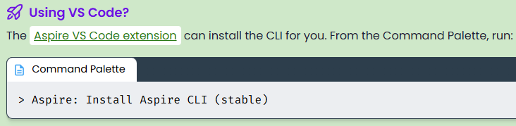
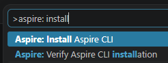

# 2. Install the Aspire CLI

Aspire provides a command‑line interface (CLI) to help you create and manage
Aspire‑based apps. The CLI streamlines your development workflow with an
interactive‑first experience.

Official guide: [Install the Aspire CLI](https://aspire.dev/get-started/install-cli/).

## Choose your installer

Choose the package manager that fits your environment — **Homebrew**, **npm**,
**NuGet**, **WinGet**, or **mise** — or use the install script for a direct setup.





## Example: install with npm

```bash
npm install -g @microsoft/aspire-cli
```

```text
changed 2 packages in 1s
```

## Verify the installation

```bash
aspire --version
```

```text
13.4.6+87fe259e4fc244c599019a7b1304c85a1488f248
```

> Throughout this guide the Aspire CLI version is **13.4.6**. Package versions you
> add later (`Aspire.Hosting.*`) are pinned to the same version for consistency.

---

[⬅ Back to index](README.md) · [⬅ Previous: Prerequisites](01-prerequisites.md) · [Next: Create a new Aspire application ➡](03-create-a-new-aspire-application.md)
