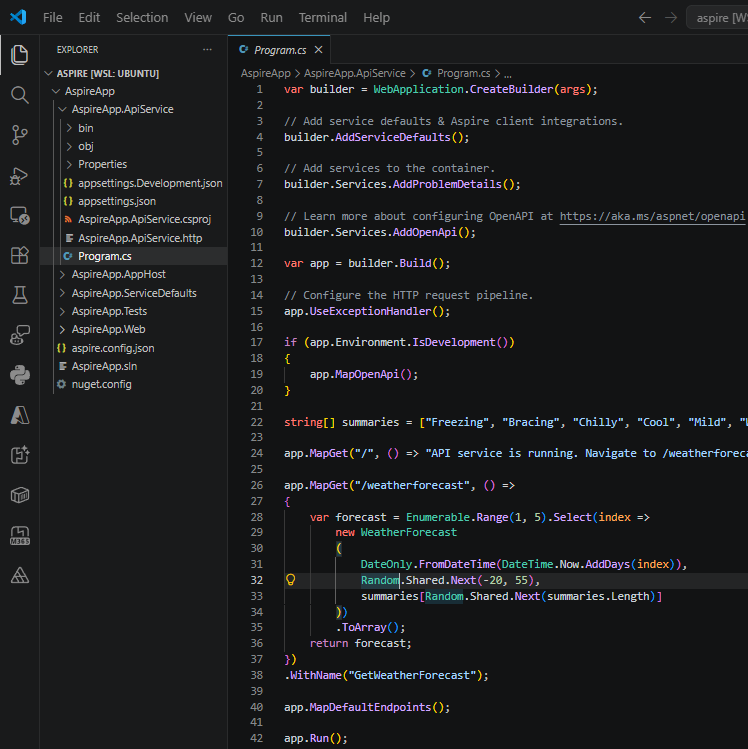
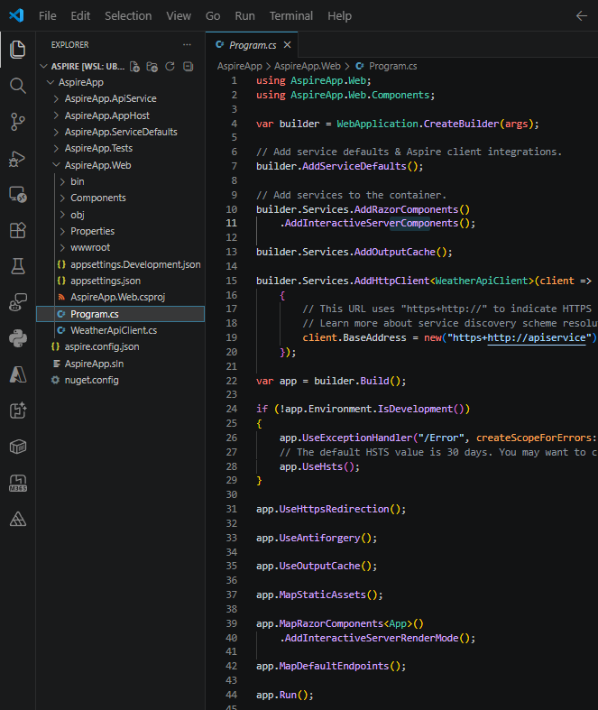
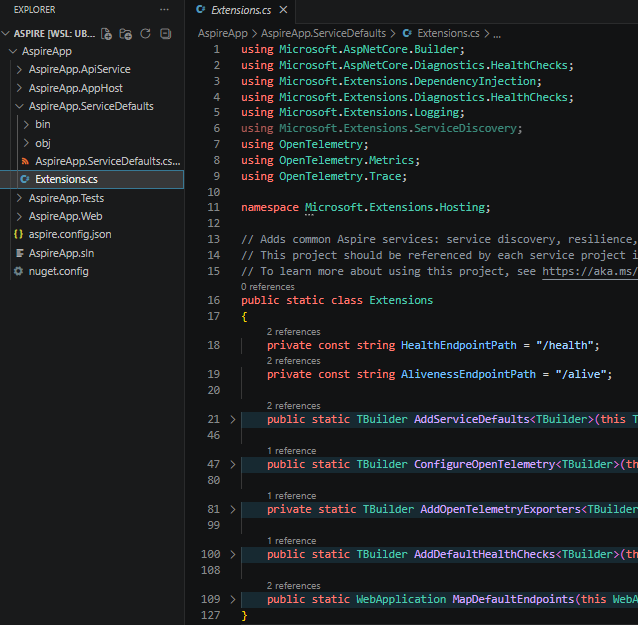
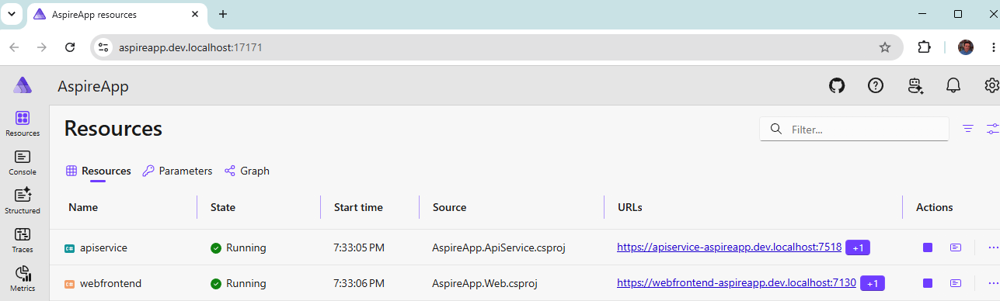
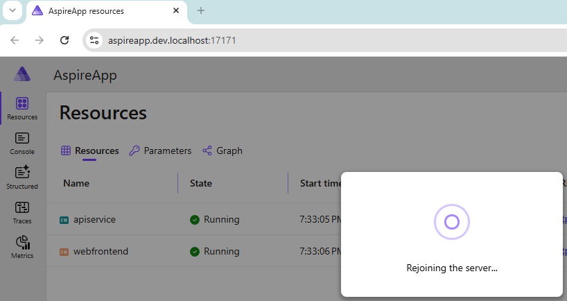
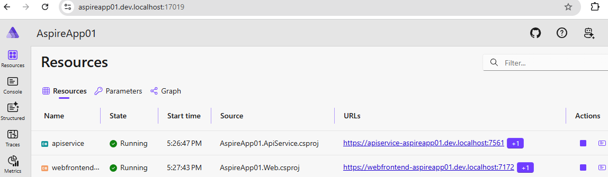
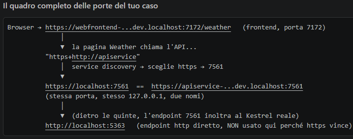
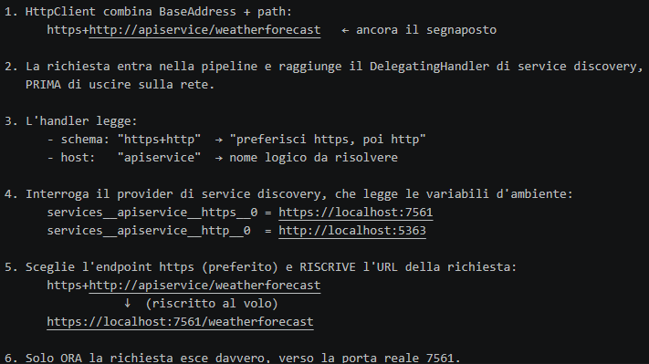

# 3. Create a new Aspire application  *(Step A)*

In this chapter we generate the solution from the **starter template** (which
already includes a **Frontend + Backend + Test** set of projects), review what was
generated, run it locally, and understand how the pieces talk to each other.

## Table of contents

- [Recap: the Aspire vocabulary](#recap-the-aspire-vocabulary)
- [The Aspire CLI at a glance (`aspire -h`)](#the-aspire-cli-at-a-glance-aspire--h)
- [Create the solution from a template](#create-the-solution-from-a-template)
- [The generated AppHost](#the-generated-apphost)
- [Who does what: AppHost vs ApiService vs Web](#who-does-what-apphost-vs-apiservice-vs-web)
- [What happens at startup](#what-happens-at-startup)
- [Run the app](#run-the-app)
- [On which ports does an Aspire project run?](#on-which-ports-does-an-aspire-project-run)
- [From `https+http://apiservice` to a real URL: service discovery](#from-httpshttpapiservice-to-a-real-url-service-discovery)

---

## Recap: the Aspire vocabulary

- **Aspire** — a framework to orchestrate the multiple components of a distributed app.
- **AppHost** — the project that starts everything.
- **Resources** — databases, queues, storage, etc. that the app uses.
- **Service** — a piece of your app (API, worker, frontend).
- **Dashboard** — the UI to see logs, dependencies, and service state.

---

## The Aspire CLI at a glance (`aspire -h`)

The Aspire CLI can be used to create, run, and publish Aspire‑based applications:

```text
$ aspire -h
Usage:
  aspire <command> [options]

App commands:
  add [<integration>]   Add a hosting integration to the AppHost
  init                  Initialize Aspire in an existing codebase
  integration           Manage Aspire hosting integrations
  ls                    List candidate AppHost project files in the workspace
  new                   Create a new app from an Aspire starter template
  ps                    List running AppHosts
  restore               Restore dependencies and generate SDK code for an AppHost
  run                   Run an Aspire AppHost interactively for development
  start                 Start an AppHost in the background
  stop                  Stop a running AppHost
  update                Update integrations in the Aspire project

Resource management:
  resource <resource> <command>   Execute a command on a resource (start, stop, restart)
  wait <resource>                 Wait for a resource to reach a target status

Monitoring:
  dashboard             Manage the Aspire dashboard (Preview)
  describe [<resource>] Describe resources in a running AppHost
  export [<resource>]   Export telemetry and resource data to a zip file
  logs [<resource>]     Display logs from resources in a running AppHost
  otel                  View OpenTelemetry data (logs, spans, traces) from a running AppHost

Deployment:
  deploy                Deploy an AppHost to its deployment targets
  destroy               Destroy a previously deployed AppHost environment
  do [<step>]           Execute a specific pipeline step and its dependencies
  publish               Generate deployment artifacts for an AppHost

Tools & configuration:
  agent     Manage AI agent environment configuration
  cache     Manage disk cache for CLI operations
  certs     Manage HTTPS development certificates
  config    Manage CLI configuration including feature flags
  docs      Browse and search Aspire documentation and API reference from aspire.dev
  doctor    Diagnose Aspire environment issues and verify setup
  mcp       Interact with MCP (Model Context Protocol) tools exposed by Aspire resources
  secret    Manage AppHost user secrets

Options:
  -?, -h, /?, /h, --help   Show help and usage information
  -v, --version            Show version information
  -l, --log-level          Set the minimum log level (Trace, Debug, Information, Warning, Error, Critical)
  --non-interactive        Run without interactive prompts and spinners
  --nologo                 Suppress the startup banner and telemetry notice
  --banner                 Display the animated Aspire CLI welcome banner
  --wait-for-debugger      Wait for a debugger to attach before executing the command
```

---

## Create the solution from a template

To create your first Aspire application, use the
[Aspire CLI](https://aspire.dev/get-started/install-cli/) to generate a new
solution from a template. These templates include multiple projects, such as an
API service, a web frontend, and an [Aspire AppHost](https://aspire.dev/get-started/app-host/).


For .NET there is always `dotnet new list`. Here, though, the command we need is:

```bash
aspire new aspire-starter -o AspireFolder01 -n AspireApp01
```

This command **creates a new Aspire application** from a predefined template called
`aspire-starter`. Breaking it down:

- **`aspire new`** — tells the CLI: *"create a new Aspire project."*
- **`aspire-starter`** — the **template** to start from. It contains:
  - a ready‑made **AppHost**,
  - a minimal **Web/API** project,
  - initial wiring for logging, dashboard, resources, etc.
- **`-n AspireApp01`** — the name of the main project (like `dotnet new -n`).
- **`-o AspireFolder01`** — the output folder where the project is generated.

In practice: 👉 *"Create a new Aspire app using the starter template, call it
`AspireApp01`, and put it in the `AspireFolder01` folder."*

### 🧭 Why this command matters

It is the fastest way to get a **complete structure** with:

- an AppHost,
- a service (API),
- Aspire configuration already in place,
- a dashboard you can bring up with `aspire run`.

---

## The generated AppHost

The AppHost is the project that **orchestrates** the other services of the
distributed app. It registers the Web and ApiService projects as resources and
connects them together.

**`AspireApp.AppHost/AppHost.cs`:**

```csharp
var builder = DistributedApplication.CreateBuilder(args);

var apiService = builder.AddProject<Projects.AspireApp_ApiService>("apiservice")
    .WithHttpHealthCheck("/health");

builder.AddProject<Projects.AspireApp_Web>("webfrontend")
    .WithExternalHttpEndpoints()
    .WithHttpHealthCheck("/health")
    .WithReference(apiService)
    .WaitFor(apiService);

builder.Build().Run();
```

**`AspireApp.AppHost/AspireApp.AppHost.csproj`:**

```xml
<Project Sdk="Aspire.AppHost.Sdk/13.4.6">
  <PropertyGroup>
    <OutputType>Exe</OutputType>
    <TargetFramework>net10.0</TargetFramework>
    <ImplicitUsings>enable</ImplicitUsings>
    <Nullable>enable</Nullable>
    <UserSecretsId>6b6f39f4-9974-49fd-b3d3-949e8237ad5e</UserSecretsId>
  </PropertyGroup>
  <ItemGroup>
    <ProjectReference Include="..\AspireApp.ApiService\AspireApp.ApiService.csproj" />
    <ProjectReference Include="..\AspireApp.Web\AspireApp.Web.csproj" />
  </ItemGroup>
  <ItemGroup>
    <PackageReference Include="Aspire.Hosting.Docker" Version="13.4.6" />
  </ItemGroup>
</Project>
```

### What each call does

- **`CreateBuilder`** — creates the builder of the **distributed application**: the
  "configurator/constructor" object with which we *describe* the application model
  (which resources exist and how they are connected).
- **`AddProject`** — registers each project as a resource of the application. The
  strings `"apiservice"` and `"webfrontend"` are the **logical (mnemonic) names** of
  the resources.
- **`WithReference(apiService)`** — connects the frontend to the backend: it injects
  the connection information (URL) as environment variables and enables service
  discovery, so in the Web code you refer to the service as `https+http://apiservice`
  instead of a fixed URL.
- **`WaitFor(apiService)`** — ensures the frontend starts only after `apiservice` is
  up and **healthy** (i.e. it passed its health check). The wait is therefore tied to
  `WithHttpHealthCheck`.
- **`WithHttpHealthCheck("/health")`** — configured here on both services. It
  indicates the HTTP endpoint (`/health`) to poll to know whether the service is
  ready/healthy.
- **`WithExternalHttpEndpoints`** — indicates that `webfrontend` must be reachable
  from the outside (e.g. from the internet in a cloud deployment). `apiservice`, not
  having it, remains reachable only internally by other services. This is a common
  security pattern: expose only the frontend, keep the backend "private".
- **`builder.Build().Run()`** — builds the final application model; `Run()` starts it
  (and with it the Aspire **Dashboard**, where you see logs, traces and metrics of
  all services).





---

## Who does what: AppHost vs ApiService vs Web

- **`AspireApp.AppHost`** is the project that **orchestrates** the other services of
  the distributed app. It registers the Web and ApiService projects as resources and
  connects them.
- Names like **`apiservice`** and **`webfrontend`** act as logical identifiers inside
  the Aspire model. **`WithReference(apiService)`** injects the API endpoints into the
  frontend as environment variables. This is what lets the frontend find the API *by
  name* (`https://apiservice`) instead of a hardcoded URL — thanks to **service
  discovery**. (Replacing `.` with `_` isn't just a convention; it's a rule that
  removes the need for an explicit mapping, so `AspireApp01.ApiService` becomes
  `AspireApp01_ApiService`.)
- **`WaitFor(apiService)`** manages the startup order (the frontend starts only when
  the API is ready).
- The **`AspireApp.ServiceDefaults`** project (referenced by the others) provides
  shared configuration for telemetry/OpenTelemetry, health checks, HTTP resilience
  and service discovery. It is the reason `WithHttpHealthCheck("/health")` works.



| | **AppHost** | **ApiService** | **Web** |
|---|---|---|---|
| Purpose | Describes the system, connects the dependencies, starts the components | Exposes HTTP endpoints, implements backend logic, may access a DB or other services | Exposes the UI/frontend, receives browser requests, calls `ApiService` when needed |

The **`ProjectReference`** entries in the AppHost `.csproj` are what allow the AppHost
to know about and include those projects in the distributed model.

---

## What happens at startup

At startup the **AppHost** goes first. Its job is to describe, prepare and
orchestrate the startup of `ApiService` and `Web` (in order) — not to replace them.

**1. You start `AspireApp.AppHost`.** Its `Program.cs` / `AppHost.cs` runs, the
`DistributedApplicationBuilder` is created, and the code registers the system's
resources (ApiService, Web, and possibly databases, caches, queues, etc.). This
phase is **declarative**: you are telling Aspire which components exist and how they
are connected.

**2. The AppHost builds the distributed‑app model.** From calls like
`AddProject(...)` and `WithReference(...)`, Aspire builds an internal model with
information such as: which project to start, its logical name, which endpoints it
exposes, its dependencies, and what information must be passed to other services.
This "Aspire‑managed configuration" is mainly *composition/deployment*
configuration, not the internal business configuration of the app. Files like
`appsettings.json`, `appsettings.Development.json` and
`Properties/launchSettings.json` remain valid inside the Web and ApiService
projects; the AppHost adds the wiring on top (endpoints, env vars, connection
strings, resolved endpoints, secrets, telemetry metadata).

**3. The AppHost starts the child projects as separate processes.** `ApiService` and
`Web` each run as their own independent ASP.NET Core application. The AppHost does
**not** host the API controllers or embed the Razor frontend inside itself — it acts
as an orchestrator, and Web and ApiService remain autonomous apps. You therefore
have multiple processes: the AppHost process, the Web process, and the ApiService
process.

**4. Aspire assigns configuration and bindings.** During startup Aspire provides the
services with environment variables, endpoint information, connections to other
resources, and naming/service discovery. For example, `ApiService` may get a dynamic
port; `Web` doesn't need to know `https://localhost:12345` in advance because Aspire
passes it the correct reference to the API. The benefit: no hardcoded URLs, no
hand‑fixed ports, centralized wiring.

**5. Each app runs its own normal ASP.NET Core startup.** Once the processes are up,
`AspireApp.ApiService` runs its normal `Program.cs` (creates the
`WebApplicationBuilder`, registers services, maps API endpoints, calls `Run()`), and
`AspireApp.Web` runs its own (creates the builder, configures Razor/Blazor/MVC,
configures an HTTP client toward the API, calls `Run()`). The important part: Web and
ApiService remain completely normal ASP.NET Core applications. **Aspire does not
rewrite them; it coordinates them.**

---

## Run the app

```bash
cd ./AspireApp
aspire run
```

When you run this command, the Aspire CLI:

- automatically finds the AppHost,
- builds your solution,
- launches dev‑time orchestration.

Once the dashboard is ready, its URL (with a login token) appears in your terminal.
The dashboard provides a live, real‑time view of your running resources and their
current states.


### Explore the running distributed application

From the dashboard, open the HTTPS endpoint of each resource.



### Stop the app

Stop the AppHost and close the dashboard by pressing <kbd>Ctrl</kbd> + <kbd>C</kbd>
in your terminal.

```text
🛑 Stopping Aspire.
```

🥳 **Congratulations! You've created your first Aspire app.**



---

## On which ports does an Aspire project run?

Each service has several addresses at the same time. There isn't a single port per
service, but **two levels** of ports.



### The two levels: proxy vs Kestrel

When you start the AppHost, Aspire (through its "control plane", DCP) creates two
distinct things for each service:

1. **The real Kestrel port** — the port the .NET process actually listens on. It is
   dynamic (it changes on every start) and "ugly": in this case `http://localhost:5363`
   for `apiservice`.
2. **The proxy endpoint** — Aspire puts a reverse proxy *in front* of Kestrel, with a
   stable, readable address: `https://apiservice-aspireapp01.dev.localhost:7561`. This
   is what you see in the dashboard, and it is the public "front door".



### Why `.dev.localhost` even when running locally

`https://apiservice-aspireapp01.dev.localhost:7561` looks like an internet domain,
but it isn't. By standard (RFC 6761), any name ending in `.localhost` always resolves
to `127.0.0.1` — your machine. So
`apiservice-aspireapp01.dev.localhost = 127.0.0.1`. Aspire uses these "speaking"
names only so you can tell at a glance which service you are reaching, and to be able
to route by name. You are running locally, no worries.

That's why opening `https://webfrontend-aspireapp01.dev.localhost:7172/weather` gives
you the page: you go through the webfrontend proxy (port 7172), which forwards to the
real Kestrel of the web app.

### Why the indexed naming scheme (`http__0`, `http__1`, …)

It supports scenarios where a service has multiple instances or multiple endpoints of
the same scheme. Examples:

- A service replicated on multiple ports for load balancing → `...http__0`,
  `...http__1`, `...http__2`.
- The service discovery client reads all indices until it finds them, and can
  choose/rotate among them.

Your current full picture is therefore:

| Variable | Value | Why |
|----------|-------|-----|
| `services__apiservice__http__0` | `http://localhost:5363` | 1st (and only) HTTP endpoint |
| `services__apiservice__http__1` | `null` (presumably) | no 2nd HTTP |
| `services__apiservice__https__0` | `https://localhost:7561` | 1st (and only) HTTPS endpoint |
| `services__apiservice__https__1` | `null` | no 2nd HTTPS |

---

## From `https+http://apiservice` to a real URL: service discovery

How do we go from the fixed string `"https+http://apiservice"` to
`https://localhost:7561/weatherforecast`?

### Step 1 — the placeholder is just stored

We are in the ordinary frontend web application, built as usual in ASP.NET through
the `WebApplication` builder. This builder adds Aspire's ServiceDefaults to the DI
container, then some Razor web UI components, and — since it needs to reach the
backend that provides the weather forecast — an `HttpClient` whose only configuration
is its `BaseAddress`.

The string `"https+http://apiservice"` is simply stored as‑is. We know it will later
have to call `https://localhost:7561/weatherforecast` (or `http://localhost:5363/...`),
i.e. it must change protocol (choosing between http and https, but only one), then the
port, and finally add the path. The substitution does **not** happen immediately — it
happens much later, on every HTTP request, thanks to an "interceptor" inserted into
the `HttpClient` pipeline. This is enabled by `builder.AddServiceDefaults()`.

If we read `client.BaseAddress` right after this line, we would see exactly
`https+http://apiservice` — unresolved. It is a "placeholder", not yet a real address.

```csharp
// Program.cs in AspireApp01.Web
var builder = WebApplication.CreateBuilder(args);

// Add service defaults & Aspire client integrations.
builder.AddServiceDefaults();

// Add services to the container.
builder.Services.AddRazorComponents()
    .AddInteractiveServerComponents();

builder.Services.AddOutputCache();

builder.Services.AddHttpClient<WeatherApiClient>(client =>
{
    // This URL uses "https+http://" to indicate HTTPS is preferred over HTTP.
    // Learn more about service discovery scheme resolution at https://aka.ms/dotnet/sdschemes.
    // "Resolve the logical name apiservice. To reach it, prefer https; if https is
    //  not available, fall back to http."
    // At launch, the AppHost injects the real URLs into the Web process as env vars:
    //   services__apiservice__https__0 = https://localhost:<https_port>
    //   services__apiservice__http__0  = http://localhost:<http_port>
    // If you removed WithReference(apiService) from the AppHost, those variables would
    // not exist and resolution would fail.
    client.BaseAddress = new("https+http://apiservice");
});
```

### Step 2 — `AddServiceDefaults()` installs the interceptor

The implementation of `AddServiceDefaults()` lives in the `AspireApp01.ServiceDefaults`
project created by the initial wizard, specifically in `Extensions.cs`.
`ConfigureHttpClientDefaults(...)` means "apply this configuration to all the app's
`HttpClient`s", such as the `AddHttpClient<WeatherApiClient>` in `Program.cs`. And
`AddServiceDiscovery()` adds to each `HttpClient` pipeline a `DelegatingHandler` (a
middleware for outgoing HTTP requests) called the service‑discovery handler. Our
`WeatherApiClient` was created with `AddHttpClient<WeatherApiClient>`, so it inherits
these defaults and therefore has the interceptor attached.

```csharp
// Extensions.cs in AspireApp01.ServiceDefaults
public static class Extensions
{
    private const string HealthEndpointPath = "/health";
    private const string AlivenessEndpointPath = "/alive";

    public static TBuilder AddServiceDefaults<TBuilder>(this TBuilder builder)
        where TBuilder : IHostApplicationBuilder
    {
        builder.ConfigureOpenTelemetry();
        builder.AddDefaultHealthChecks();
        builder.Services.AddServiceDiscovery();
        builder.Services.ConfigureHttpClientDefaults(http =>
        {
            // Turn on resilience by default
            http.AddStandardResilienceHandler();
            // Turn on service discovery by default
            http.AddServiceDiscovery();
        });
        // ...
    }
}
```

### Step 3 — the substitution happens per request, inside the interceptor

When the Weather page runs (in `WeatherApiClient.cs`)
`httpClient.GetFromJsonAsAsyncEnumerable<WeatherForecast>("/weatherforecast")`, this
chain happens:



**In summary:**

| Moment | What the address contains |
|--------|---------------------------|
| The `BaseAddress = ...` line | `https+http://apiservice` (placeholder, unchanged) |
| Combined with the path | `https+http://apiservice/weatherforecast` |
| Inside the `DelegatingHandler` (at runtime, per request) | rewritten to `https://localhost:7561/weatherforecast` |
| On the wire | goes out to `localhost:7561` |

So the "fixed" string is never modified in your code: it is a logical name that a
middleware translates into the real address on every call, reading the variables
injected by the AppHost.

```csharp
// WeatherApiClient.cs in AspireApp01.Web
namespace AspireApp01.Web;

public class WeatherApiClient(HttpClient httpClient)
{
    public async Task<WeatherForecast[]> GetWeatherAsync(int maxItems = 10, CancellationToken cancellationToken = default)
    {
        List<WeatherForecast>? forecasts = null;

        await foreach (var forecast in httpClient.GetFromJsonAsAsyncEnumerable<WeatherForecast>("/weatherforecast", cancellationToken))
        {
            if (forecasts?.Count >= maxItems)
            {
                break;
            }
            if (forecast is not null)
            {
                forecasts ??= [];
                forecasts.Add(forecast);
            }
        }

        return forecasts?.ToArray() ?? [];
    }
}

public record WeatherForecast(DateOnly Date, int TemperatureC, string? Summary)
{
    public int TemperatureF => 32 + (int)(TemperatureC / 0.5556);
}
```

---

[⬅ Back to index](README.md) · [⬅ Previous: Install the Aspire CLI](02-install-aspire-cli.md) · [Next: Add an ASP.NET Web API ➡](04-add-an-aspnet-web-api.md)
