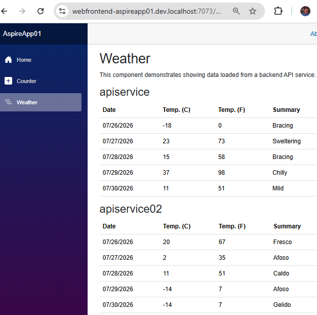

# 4. Add an ASP.NET Web API  *(Step B)*

Here is the clean path, in the right order, to add a **new .NET project** (for
example a second API or a worker) to the Aspire solution. Variants are listed at the
end.

## Table of contents

- [Step‑by‑step: add the project](#stepbystep-add-the-project)
- [Register the new service in the AppHost](#register-the-new-service-in-the-apphost)
- [Why `WeatherForecast` and `WeatherApiClient` exist](#why-weatherforecast-and-weatherapiclient-exist)
- [Why `AddHttpClient` is needed](#why-addhttpclient-is-needed)
- [How many return types to register](#how-many-return-types-to-register)
- [Wire the client to the Razor frontend](#wire-the-client-to-the-razor-frontend)
- [Redeploy](#redeploy)
- [Variants](#variants)

---

## Step‑by‑step: add the project

**1. Create the project and add it to the solution.** From the solution root:

```bash
# e.g. a new Web API
dotnet new webapi -o AspireApp01.ApiService02
dotnet sln add AspireApp01.ApiService02/AspireApp01.ApiService02.csproj
```

This adds the following to `AspireApp01.sln` in the solution root:

```text
Project("{FAE04EC0-301F-11D3-BF4B-00C04F79EFBC}") = "AspireApp01.ApiService02", "AspireApp01.ApiService02\AspireApp01.ApiService02.csproj", "{72D44D79-87C2-47E0-B307-FF43A4C2A36A}"
EndProject
```

**2. Link `ServiceDefaults` to the new project.** This gives the new service
telemetry, health checks, service discovery and resilience (like the others):

```bash
dotnet add AspireApp01.ApiService02/AspireApp01.ApiService02.csproj \
  reference AspireApp01.ServiceDefaults/AspireApp01.ServiceDefaults.csproj
```

which adds to its `.csproj`:

```xml
<ItemGroup>
  <ProjectReference Include="..\AspireApp01.ServiceDefaults\AspireApp01.ServiceDefaults.csproj" />
</ItemGroup>
```

**3. In its `Program.cs`, right after `CreateBuilder`** — inject the middleware that
provides the services contained in `ServiceDefaults`:

```csharp
builder.AddServiceDefaults();      // near the top
```

**4. In its `Program.cs`, before `app.Run()`** — this uses one of the
`ServiceDefaults` services, in particular for the `/health` path:

```csharp
app.MapDefaultEndpoints();         // before app.Run()
```

**5. Remove `app.UseHttpsRedirection();`** — it will be handled by Aspire:

```csharp
app.UseHttpsRedirection();   // ← remove this line
```

**6. Reference the new project from the AppHost** — the AppHost must "know" the
project in order to orchestrate it:

```bash
dotnet add AspireApp01.AppHost/AspireApp01.AppHost.csproj \
  reference AspireApp01.ApiService02/AspireApp01.ApiService02.csproj
```

which adds to the AppHost `.csproj`:

```xml
<ItemGroup>
  <ProjectReference Include="..\AspireApp01.ApiService\AspireApp01.ApiService.csproj" />
  <ProjectReference Include="..\AspireApp01.Web\AspireApp01.Web.csproj" />
  <ProjectReference Include="..\AspireApp01.ApiService02\AspireApp01.ApiService02.csproj" />
</ItemGroup>
```

---

## Register the new service in the AppHost

Add the resource and wire it up as needed, reusing the patterns you already know.
The choices depend on the role:

- Should it be exposed externally? → `.WithExternalHttpEndpoints()` (otherwise it
  stays internal, like `apiservice`).
- Who calls it? → add `.WithReference(apiService02)` on the *caller* (this injects the
  service‑discovery env vars).
- Startup dependencies? → `.WaitFor(...)`.

```csharp
var apiService = builder.AddProject<Projects.AspireApp01_ApiService>("apiservice")
    .WithHttpHealthCheck("/health");

// NEW service
var apiService02 = builder.AddProject<Projects.AspireApp01_ApiService02>("apiservice02")
    .WithHttpHealthCheck("/health");

builder.AddProject<Projects.AspireApp01_Web>("webfrontend")
    .WithExternalHttpEndpoints()
    .WithHttpHealthCheck("/health")
    .WithReference(apiService)
    .WithReference(apiService02)   // if the web app needs to call it
    .WaitFor(apiService)
    .WaitFor(apiService02);
```

---

## Why `WeatherForecast` and `WeatherApiClient` exist

- **`WeatherForecast`** — the *data model* (a record). It represents the shape of the
  JSON returned by `/weatherforecast`. It is used to deserialize the HTTP response into
  typed C# objects instead of raw strings.
- **`WeatherApiClient`** — the *typed client*: it encapsulates the logic of calling the
  API (the `GetWeatherAsync` method, the `/weatherforecast` path, deserialization into
  `WeatherForecast[]`). It isolates the network code from the UI, so the Razor page only
  does `WeatherApi.GetWeatherAsync()` without knowing how the call happens.
- The `/weatherforecast` path is added when we make the call, inside
  `WeatherApiClient.GetWeatherAsync`.

```csharp
// AspireApp01.Web.WeatherApiClient.cs
namespace AspireApp01.Web;

public class WeatherApiClient(HttpClient httpClient)
{
    public async Task<WeatherForecast[]> GetWeatherAsync(int maxItems = 10, CancellationToken cancellationToken = default)
    {
        List<WeatherForecast>? forecasts = null;

        await foreach (var forecast in httpClient.GetFromJsonAsAsyncEnumerable<WeatherForecast>("/weatherforecast", cancellationToken))
        {
            if (forecasts?.Count >= maxItems)
            {
                break;
            }
            if (forecast is not null)
            {
                forecasts ??= [];
                forecasts.Add(forecast);
            }
        }

        return forecasts?.ToArray() ?? [];
    }
}

// Second typed client: reuses the same logic as WeatherApiClient,
// but receives an HttpClient configured towards "apiservice02".
public class WeatherApiClient2(HttpClient httpClient) : WeatherApiClient(httpClient);

public record WeatherForecast(DateOnly Date, int TemperatureC, string? Summary)
{
    public int TemperatureF => 32 + (int)(TemperatureC / 0.5556);
}
```

---

## Why `AddHttpClient` is needed

- **`AddHttpClient<WeatherApiClient>`** *registers* the typed client `WeatherApiClient`
  in dependency injection and associates it with a configured `HttpClient` (here the
  `BaseAddress` with service discovery `https+http://apiservice`). It also provides
  correct connection‑lifetime management (via `IHttpClientFactory`) and allows the
  client to be injected where needed (`@inject WeatherApiClient`).
- The `/weatherforecast` path is **not** in the `BaseAddress`. The `BaseAddress` is only
  the logical host of the service (e.g. `https+http://apiservice`).

In short: `WeatherForecast` = *what* you receive, `WeatherApiClient` = *how* you ask for
it, `AddHttpClient` = *who* configures and provides it via DI.

```csharp
// ./AspireApp01.Web/Program.cs
builder.Services.AddHttpClient<WeatherApiClient>(client =>
{
    // This URL uses "https+http://" to indicate HTTPS is preferred over HTTP.
    // Learn more about service discovery scheme resolution at https://aka.ms/dotnet/sdschemes.
    client.BaseAddress = new("https+http://apiservice");
});
```

---

## How many return types to register

1. If we have two different calls, they may of course return two different response
   types. So we cannot register the same return type twice. If you register
   `AddHttpClient<WeatherApiClient>` twice, you do **not** get two clients — the second
   registration overwrites the first.
2. To have two clients toward two different services you need a different type for each.
   At the limit, if the type is the same, you simply register a second one that
   *derives entirely* from the first but with a different name:
   `public class WeatherApiClient2(HttpClient httpClient) : WeatherApiClient(httpClient);`.
3. `https+http://` tells Aspire: *try HTTPS first, then HTTP*. The name (`apiservice`)
   is resolved to the real port thanks to `WithReference(...)` in the AppHost (which you
   now have for both).

```csharp
// ./AspireApp01.Web/Program.cs
builder.Services.AddHttpClient<WeatherApiClient>(client =>
{
    // This URL uses "https+http://" to indicate HTTPS is preferred over HTTP.
    // Learn more about service discovery scheme resolution at https://aka.ms/dotnet/sdschemes.
    client.BaseAddress = new("https+http://apiservice");
});

builder.Services.AddHttpClient<WeatherApiClient2>(client =>
{
    // Points to the second service. Same "/weatherforecast" endpoint, different service.
    client.BaseAddress = new("https+http://apiservice02");
});
```

---

## Wire the client to the Razor frontend

Everything happens in `Weather.razor`:

- Inject the `WeatherApiClient` class (via `@inject`) giving it the local name
  `WeatherApi`.

  > **Note:** `@inject` does not "connect the class" in the strict sense: it asks
  > dependency injection for an already‑configured instance of `WeatherApiClient` (the
  > one registered with `AddHttpClient` in `Program.cs`). The client↔service binding is
  > defined by that registration, not by `@inject`.

- In the template initialization (`OnInitializedAsync` in the `@code` section), set the
  `forecasts` array (plural) to the value returned by `GetWeatherAsync` on the
  `WeatherApiClient` class.
- In the section under `<h2>apiservice</h2>`, with a `@foreach`, extract each `forecast`
  (singular) from `forecasts` and add it as a row in a table.

```razor
@* ./AspireApp01.Web/Components/Pages/Weather.razor *@
<h2>apiservice</h2>
@if (forecasts == null)
{
    <p><em>Loading...</em></p>
}
else
{
    <table class="table">
        <thead>
            <tr>
                <th>Date</th>
                <th aria-label="Temperature in Celsius">Temp. (C)</th>
                <th aria-label="Temperature in Fahrenheit">Temp. (F)</th>
                <th>Summary</th>
            </tr>
        </thead>
        <tbody>
            @foreach (var forecast in forecasts)
            {
                <tr>
                    <td>@forecast.Date.ToShortDateString()</td>
                    <td>@forecast.TemperatureC</td>
                    <td>@forecast.TemperatureF</td>
                    <td>@forecast.Summary</td>
                </tr>
            }
        </tbody>
    </table>
}

...

@code {
    private WeatherForecast[]? forecasts;
    private WeatherForecast[]? forecasts2;

    protected override async Task OnInitializedAsync()
    {
        forecasts = await WeatherApi.GetWeatherAsync();
    }
}
```

If we now run `aspire run`, we get two weather tables — one per API service:



---

## Redeploy

Once it works locally, redeploy to the chosen target (Docker Compose or ACA): Aspire
automatically regenerates the artifacts, including the new service (one more
container / one more Container App).

---

## Variants

- **Worker / non‑HTTP service** (e.g. a background job): same steps, but no
  `WithExternalHttpEndpoints`/HTTP health check; use `dotnet new worker`.
- **Non‑.NET app** (Node, Python, existing container): instead of `AddProject` you use
  `AddNpmApp`, `AddPythonApp` or `AddContainer`, but steps 3–7 remain conceptually
  identical. *(The Python case is exactly what the next two chapters cover.)*
- **Shortcut:** for well‑known integrations (Postgres, Redis, etc.) use
  `aspire add <name>` instead of creating a project.

---

[⬅ Back to index](README.md) · [⬅ Previous: Create a new Aspire application](03-create-a-new-aspire-application.md) · [Next: Python FastAPI ➡](05-python-fastapi.md)
