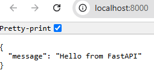
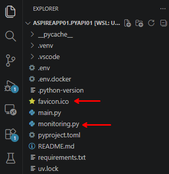
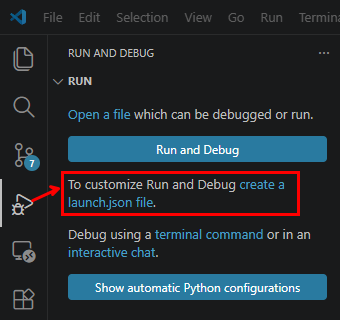

# 5. Python FastAPI  *(Step C)*

In this chapter we create a **Python FastAPI** service, run it locally with uvicorn,
and then package it (standalone, for testing) into a **Docker container**. Adding it
to the Aspire solution comes in the [next chapter](06-integrate-python-into-aspire.md).

## Table of contents

- [Why FastAPI is a good fit for Aspire](#why-fastapi-is-a-good-fit-for-aspire)
- [Mini‑schema of the Python project in Aspire](#minischema-of-the-python-project-in-aspire)
- [A dedicated folder: `AspireApp01.PyApi01`](#a-dedicated-folder-aspireapp01pyapi01)
- [Mini‑roadmap](#miniroadmap)
- [1. Create and enter the folder](#1-create-and-enter-the-folder)
- [2. Initialize the Python project](#2-initialize-the-python-project)
- [3. Write the minimal FastAPI app](#3-write-the-minimal-fastapi-app)
- [4. Run uvicorn locally](#4-run-uvicorn-locally)
- [5. Containerize with a Dockerfile](#5-containerize-with-a-dockerfile)

---

## Why FastAPI is a good fit for Aspire

- **ASGI** — Aspire integrates well with ASGI servers, and FastAPI is natively ASGI.
- **Uvicorn** — the server that actually "listens" on the port and starts your app.
- **OpenAPI** — you automatically get interactive documentation, useful for your
  consumers too.

---

## Mini‑schema of the Python project in Aspire

- **`main.py`** → define FastAPI and the endpoints.
- **uvicorn** → server startup.
- **`Dockerfile`** → the container Aspire will orchestrate.
- **AppHost** → register the Python service (later) as `builder.AddUvicornApp("pyapi01", ...)`.

---

## A dedicated folder: `AspireApp01.PyApi01`

**Does it make sense to create an `AspireApp01.PyApi01` folder and develop the FastAPI
app there? Yes!**

Inside an Aspire solution you can freely add an `AspireApp01.PyApi01` folder containing
your Python FastAPI project. Aspire does not require the Python project to be "created"
by Aspire: it simply sees it as a **containerized service**.

- Aspire treats a Python app as an **external service**, so you can put it wherever you
  want in the solution.
- The dedicated folder lets you have a Python project with its own **virtual
  environment**, its own **`main.py`**, and its own **`Dockerfile`**.
- When it is ready, you will register it in the AppHost with something like
  `builder.AddUvicornApp("pyapi01", path, "main:app")`.

---

## Mini‑roadmap

1. Create and enter the `AspireApp01.PyApi01` folder.
2. Load VS Code, then initialize the Python project.
3. Remove the boilerplate and write the minimal FastAPI `main`.
4. Run uvicorn locally.
5. When it works → **containerize with a Dockerfile**.
6. Only then → [integrate the Python app into Aspire](06-integrate-python-into-aspire.md).

---

## 1. Create and enter the folder

```bash
mkdir AspireApp01.PyApi01
cd AspireApp01.PyApi01
```

---

## 2. Initialize the Python project

Load VS Code, then initialize the project with the [`uv`](https://docs.astral.sh/uv/)
package manager.

```bash
code . --reuse-window

# 1. MKDIR the new folder and CD into it (done above)

# 2. Create the environment
uv init . --python 3.13

# 3. Create the local virtual environment
uv venv

# 4. Activate the environment:
source .venv/bin/activate          # on Linux/macOS
.\.venv\Scripts\activate.ps1       # on Windows

# 5. Add libraries (it's KEY to use `--active`):
uv add --active $(cat requirements.txt) --prerelease=allow   # automatically, from requirements.txt
uv add --active <package-name> --prerelease=allow            # manually

# 6. Check that the packages are installed
uv pip list
```

**`requirements.txt`:**

```text
python-dotenv==1.2.2
azure-monitor-opentelemetry==1.8.9
fastapi==0.139.2
uvicorn[standard]==0.51.0
debugpy==1.8.21
```

---

## 3. Write the minimal FastAPI app

Remove the boilerplate and write a minimal `main.py`.

**What it contains:**

- A `FastAPI` instance.
- A single **GET `/`** endpoint that returns JSON.
- No extra dependencies, no advanced configuration.

Even though it's not mandatory, we remove the default guard, because FastAPI does
**not** require `if __name__ == "__main__":`.

```python
from fastapi import FastAPI

app = FastAPI()

@app.get("/")
def read_root():
    return {"message": "Hello from FastAPI"}
```



### Add `monitoring.py` + `favicon.ico`, and integrate logging



```python
from fastapi import FastAPI
from monitoring import logger

logger.info(f"Program started.")

app = FastAPI()

@app.get("/")
def read_root():
    logger.info(f"Root endpoint accessed.")
    return {"message": "Hello from FastAPI"}
```

### Expose the call on `/weatherforecast`

```python
@app.get("/weatherforecast")
def read_weather_forecast():
    logger.info(f"Weather forecast endpoint accessed.")
    summaries = ["Helado", "Refrescante", "Frío", "Fresco", "Templado",
                 "Cálido", "Agradable", "Caliente", "Sofocante", "Abrumador"]
    today = date.today()
    return [
        {
            "date": (today + timedelta(days=i)).isoformat(),
            "temperatureC": random.randint(-20, 55),
            "summary": random.choice(summaries),
        }
        for i in range(1, 6)
    ]
```

### Create `.env`

```dotenv
APPLICATIONINSIGHTS_CONNECTION_STRING=InstrumentationKey=<your-key>;IngestionEndpoint=https://swedencentral-0.in.applicationinsights.azure.com/;LiveEndpoint=https://swedencentral.livediagnostics.monitor.azure.com/;ApplicationId=<your-app-id>
THISAPP_NAME=PyApi01
```

> The connection string and application id above are placeholders — use your own
> Application Insights values.

---

## 4. Run uvicorn locally

**From the command line:**

```bash
uvicorn main:app --host 0.0.0.0 --port 8000
```

**With the debugger** → `.vscode/launch.json`:

```json
{
    // Use IntelliSense to learn about possible attributes.
    // Hover to view descriptions of existing attributes.
    // For more information, visit: https://go.microsoft.com/fwlink/?linkid=830387
    "version": "0.2.0",
    "configurations": [
        {
            "name": "FastAPI Debug",
            "type": "debugpy",
            "request": "launch",
            "module": "uvicorn",
            "args": [
                "main:app",
                "--host", "0.0.0.0",
                "--port", "8000",
                "--reload"
            ],
            "jinja": true
        }
    ]
}
```



---

## 5. Containerize with a Dockerfile

Once the app works locally, package it into a container and test it **standalone**
(before adding it to Aspire).

**`Dockerfile`:**

```dockerfile
FROM python:3.11-slim
WORKDIR /app
COPY requirements.txt .
RUN pip install --no-cache-dir -r requirements.txt
COPY main.py monitoring.py favicon.ico ./
CMD ["uvicorn", "main:app", "--host", "0.0.0.0", "--port", "8000"]
```

**Clean the environment if needed** (removes *all* containers and images):

```bash
for id in $(docker images -aq); do docker rmi -f "$id"; done
for id in $(docker ps -aq); do docker rm -f "$id"; done
```

**Create `.env.docker`** (optional):

```dotenv
APPLICATIONINSIGHTS_CONNECTION_STRING=InstrumentationKey=<your-key>;IngestionEndpoint=https://swedencentral-0.in.applicationinsights.azure.com/;LiveEndpoint=https://swedencentral.livediagnostics.monitor.azure.com/;ApplicationId=<your-app-id>
THISAPP_NAME=PyApi01
```

**Build the container:**

```bash
docker build -t pyapi01 .
```

**Run the container on port 8080** (mapping to the container's 8000):

```bash
docker run --rm -p 8080:8000 --env-file .env.docker pyapi01
```

…and now **test it!** → <http://localhost:8080>

Once the standalone container works, we are ready to hand the Python app over to
Aspire.

---

[⬅ Back to index](README.md) · [⬅ Previous: Add an ASP.NET Web API](04-add-an-aspnet-web-api.md) · [Next: Integrate the Python app into Aspire ➡](06-integrate-python-into-aspire.md)
