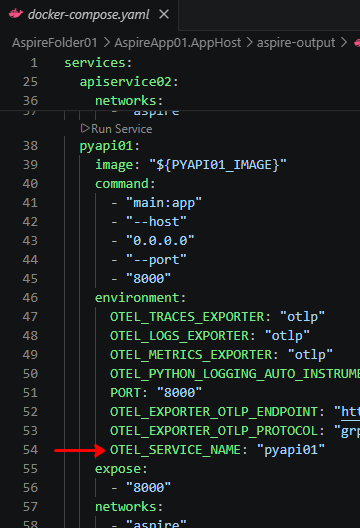
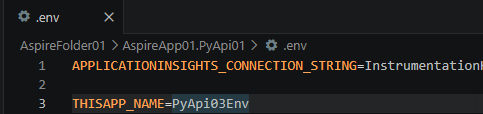
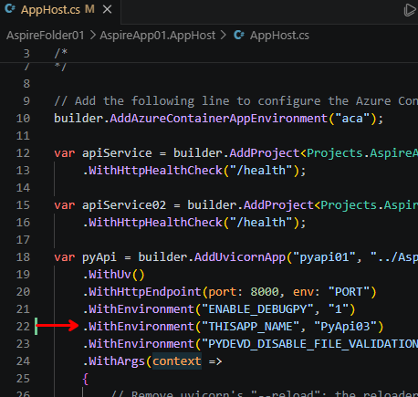
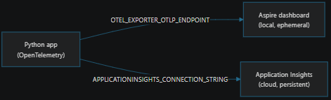

# 6. Integrate the Python app into Aspire  *(Step D)*

Now that the Python FastAPI service works standalone (and inside its own container),
we hand it over to Aspire so it is orchestrated exactly like the .NET services.

## Table of contents

- [0. General information](#0-general-information)
- [1. Containerize the Python app](#1-containerize-the-python-app)
- [2. Add the `Aspire.Hosting.Python` integration](#2-add-the-aspirehostingpython-integration)
- [3. Add the `/health` path to the Python app](#3-add-the-health-path-to-the-python-app)
- [4. Register the Python app in the AppHost](#4-register-the-python-app-in-the-apphost)
- [5. Expose the Python application's API](#5-expose-the-python-applications-api)
- [6. Set up discovery for the Python API](#6-set-up-discovery-for-the-python-api)
- [Key point: Dependency Injection and the typed client](#key-point-dependency-injection-and-the-typed-client)
- [Observability — setting `cloud_RoleName`](#observability--setting-cloud_rolename)
- [Telemetry destinations: Aspire dashboard vs. Application Insights](#telemetry-destinations-aspire-dashboard-vs-application-insights)

---

## 0. General information

**🧩 Why do the .NET projects have no Dockerfile, while Python does?** Because:

- .NET has a **builder integrated** in Aspire → it automatically generates a container.
- Python **has no integrated builder** → it needs a Dockerfile.

Aspire containerizes everything, but for Python it must be told *how* to do it.

**🎯 Objective:** add the Python application **`AspireApp01.PyApi01`** to the AppHost,
then let Aspire:

- build the container from our Dockerfile,
- start FastAPI,
- assign the port,
- manage the health check,
- manage service discovery.

**Do we add the Python project to the AppHost `.csproj`? NO, but…** We cannot add the
Python project name to the Aspire AppHost, because:

- there is no referenceable file (like `.csproj`, `.fsproj`, `.vbproj`),
- Aspire does **not** use `ProjectReference` for non‑.NET projects.

However, in the `.csproj` we must still add the Python integration called
**`Aspire.Hosting.Python`**. This package:

- registers Python projects as "Aspire projects",
- enables `builder.AddUvicornApp(<name>, <path>, <module like "main:app">)`,
- enables the automatic build of the Dockerfile,
- enables local execution inside Aspire.

**Do we add the Python project to the Aspire SOLUTION? NO!** No non‑.NET project
appears in the Aspire *solution*, and that is **normal**. Aspire cannot automatically
find a Python project in the solution because it is not an MSBuild project. Aspire only
sees .NET projects (they have a `.csproj`), the AppHost (a .NET project) and other
MSBuild projects. A Python project has no `.csproj`, is not an MSBuild project, and
therefore cannot appear in the solution. **Aspire manages it only by path, not through
the project system.**

So the two things we do are:

1. **Tell the AppHost to include that project** using the dedicated method.
2. Aspire builds the container, starts it, assigns it a port, and connects it to the
   other services.

---

## 1. Containerize the Python app

This was done in the [previous chapter](05-python-fastapi.md#5-containerize-with-a-dockerfile).
For reference, the Dockerfile is:

```dockerfile
FROM python:3.11-slim
WORKDIR /app
COPY requirements.txt .
RUN pip install --no-cache-dir -r requirements.txt
COPY main.py monitoring.py favicon.ico ./
CMD ["uvicorn", "main:app", "--host", "0.0.0.0", "--port", "8000"]
```

---

## 2. Add the `Aspire.Hosting.Python` integration

First, clean the NuGet package cache for this Aspire project. This prevents the next
`Restore` from taking too long:

```bash
dotnet nuget locals all --clear
```

```text
Clearing NuGet HTTP cache: /home/mauromi/.local/share/NuGet/http-cache
Clearing NuGet global packages folder: /home/mauromi/.nuget/packages/
Clearing NuGet Temp cache: /tmp/NuGetScratchmauromi
Clearing NuGet plugins cache: /home/mauromi/.local/share/NuGet/plugin-cache
Local resources cleared.
```

You can either add the entry to `AspireApp01.AppHost.csproj` directly, or (as done
here) use a command:

```bash
dotnet add AspireApp01.AppHost package Aspire.Hosting.Python --version 13.4.6
```

Installing the package automatically triggers a `Restore` (unless you pass
`--norestore`, but then you'd have to run restore separately, so keep it simple):

```text
info : X.509 certificate chain validation will use the fallback certificate bundle at '/usr/lib/dotnet/sdk/10.0.110/trustedroots/codesignctl.pem'.
info : X.509 certificate chain validation will use the fallback certificate bundle at '/usr/lib/dotnet/sdk/10.0.110/trustedroots/timestampctl.pem'.
info : Adding PackageReference for package 'Aspire.Hosting.Python' into project '.../AspireApp01.AppHost/AspireApp01.AppHost.csproj'.
...
log  : Restored .../AspireApp01.AppHost/AspireApp01.AppHost.csproj (in 12.71 sec).
```

> Note the message *"X.509 certificate chain validation will use the fallback
> certificate bundle"* — it shouldn't strictly happen, but it doesn't matter; at worst
> the automatic restore takes a few seconds longer. What matters is that all operations
> complete correctly.

The result in `AspireApp01.AppHost.csproj` (using a command like this is cleaner and
more "enterprise" than editing by hand; and although the two `<ItemGroup>` blocks could
be merged, we keep them separate for clarity):

```xml
<Project Sdk="Aspire.AppHost.Sdk/13.4.6">
  <PropertyGroup>
    <OutputType>Exe</OutputType>
    <TargetFramework>net10.0</TargetFramework>
    <ImplicitUsings>enable</ImplicitUsings>
    <Nullable>enable</Nullable>
    <UserSecretsId>dc27b775-2a17-457d-bbda-2bdd30b0304c</UserSecretsId>
  </PropertyGroup>
  <ItemGroup>
    <ProjectReference Include="..\AspireApp01.ApiService\AspireApp01.ApiService.csproj" />
    <ProjectReference Include="..\AspireApp01.Web\AspireApp01.Web.csproj" />
    <ProjectReference Include="..\AspireApp01.ApiService02\AspireApp01.ApiService02.csproj" />
  </ItemGroup>
  <ItemGroup>
    <PackageReference Include="Aspire.Hosting.Python" Version="13.4.6" />
  </ItemGroup>
</Project>
```

---

## 3. Add the `/health` path to the Python app

Add the `/health` path to `main.py` for the "health" check. In the next step,
`WithHttpHealthCheck("/health")` will have Aspire poll this `/health` endpoint.

How the mechanism works:

- `WithHttpHealthCheck("/health")` is on the **AppHost/Aspire** side: it only configures
  an HTTP probe that periodically calls `GET /health` on the resource. **It does not
  create any endpoint.**
- The endpoint must be implemented in the application (in our case, FastAPI). In ASP.NET
  projects it works because `MapDefaultEndpoints()` in `ServiceDefaults` automatically
  exposes `/health` — but for the Python app that mechanism doesn't exist, so we must
  define it by hand.

```python
# ./AspireApp01.PyApi01/main.py
from fastapi import FastAPI
from monitoring import logger

logger.info(f"Program started.")

app = FastAPI()

@app.get("/")
def read_root():
    logger.info(f"Root endpoint accessed.")
    return {"message": "Hello from FastAPI"}

@app.get("/health")
def health_check():
    return {"status": "healthy"}

@app.get("/WeatherForecast")
def read_weather_forecast():
    logger.info(f"Weather forecast endpoint accessed.")
    return {"message": "Weather forecast data"}
```

---

## 4. Register the Python app in the AppHost

Our Python project uses FastAPI/uvicorn. With `Aspire.Hosting.Python` you do **not** use
`AddProject` (reserved for .NET `.csproj`) but the dedicated method for Python apps. For
the 13.4.6 version we added above, the method to use is **`AddUvicornApp`** (provided by
`Aspire.Hosting.Python`), designed for ASGI applications like FastAPI/Starlette/Quart.

**🎯 Short explanation:**

- `var pyApi = builder.AddUvicornApp("pyapi01", "../AspireApp01.PyApi01", "main:app")` →
  Aspire uses **the path** to find the Python project and its **Dockerfile**, from which
  it builds the container at deploy time. Since our `main.py` has `app = FastAPI()`, the
  ASGI reference is `"main:app"`. Also, the health check points to `/health`, but that
  endpoint didn't originally exist in our `main.py` (we only had `/` and
  `/weatherforecast`), so it must be added — otherwise the resource stays "Unhealthy".
- `.WithUv()` avoids a later deployment error that would otherwise try to run
  `pip install .`.
- `.WithHttpEndpoint(port: 8000)` — FastAPI listens on **8000**, so we declare it to let
  Aspire expose the service.
- `.WithHttpHealthCheck("/health")` — as explained above. It does **not** create the
  endpoint: we implement it in the Python app.
- `.WithReference(pyApi)` — if we want to be able to reach the Python API.
- `.WaitFor(pyApi)` — best practice to wait for dependent services (here, from the web
  frontend).

```csharp
# ./AspireApp01.AppHost/AppHost.cs
var builder = DistributedApplication.CreateBuilder(args);

var apiService = builder.AddProject<Projects.AspireApp01_ApiService>("apiservice")
    .WithHttpHealthCheck("/health");

var apiService02 = builder.AddProject<Projects.AspireApp01_ApiService02>("apiservice02")
    .WithHttpHealthCheck("/health");

var pyApi = builder.AddUvicornApp("pyapi01", "../AspireApp01.PyApi01", "main:app")
    .WithUv()
    .WithHttpEndpoint(port: 8000, env: "PORT")
    .WithHttpHealthCheck("/health");

builder.AddProject<Projects.AspireApp01_Web>("webfrontend")
    .WithExternalHttpEndpoints()
    .WithHttpHealthCheck("/health")
    .WithReference(apiService)
    .WithReference(apiService02)
    .WithReference(pyApi)
    .WaitFor(apiService)
    .WaitFor(apiService02)
    .WaitFor(pyApi);

builder.Build().Run();
```

---

## 5. Expose the Python application's API

In addition to the `/health` path implemented above, we set up the paths through which
our Python application can be consumed. The whole file is short, so it is shown in full;
note in particular the `"/weatherforecast"` path, which — remember — is **case
sensitive**. That path returns an array of JSON objects (itself valid JSON) where each
object has three key/value pairs: `date`, `temperature`, and `summary`.

```python
# ./AspireApp01.PyApi01/main.py
from fastapi import FastAPI
from monitoring import logger
from datetime import date, timedelta
import random

logger.info(f"Program started.")

app = FastAPI()

@app.get("/")
def read_root():
    logger.info(f"Root endpoint accessed.")
    return {"message": "Hello from FastAPI"}

@app.get("/health")
def health_check():
    return {"status": "healthy"}

@app.get("/weatherforecast")
def read_weather_forecast():
    logger.info(f"Weather forecast endpoint accessed.")
    summaries = ["Helado", "Refrescante", "Frío", "Fresco", "Templado",
                 "Cálido", "Agradable", "Caliente", "Sofocante", "Abrumador"]
    today = date.today()
    return [
        {
            "date": (today + timedelta(days=i)).isoformat(),
            "temperatureC": random.randint(-20, 55),
            "summary": random.choice(summaries),
        }
        for i in range(1, 6)
    ]
```

---

## 6. Set up discovery for the Python API

We proceed similarly to how we set up discovery for the second Web API.

Remember that the Aspire template gave us "for free" the `WeatherApiClient` class, which
exposes the public method `GetWeatherAsync` returning the `WeatherForecast[]` array of
individual forecasts (`public record WeatherForecast`). This class lives in the
same‑named file `WeatherApiClient.cs` of the Web project, which consumes the API exposed
by the ASP.NET and Python projects integrated in the Aspire solution.

### Key point: Dependency Injection and the typed client

As with a classic Dependency Injection container, this class receives as a parameter the
`httpClient` object that was injected into the container in the Web project's
`Program.cs`:

```csharp
builder.Services.AddHttpClient<WeatherApiClient>(client =>
{
    // This URL uses "https+http://" to indicate HTTPS is preferred over HTTP.
    // Learn more about service discovery scheme resolution at https://aka.ms/dotnet/sdschemes.
    client.BaseAddress = new("https+http://apiservice");
});
```

This means that when this class is instantiated, it is passed the `httpClient` object
already populated in its `client.BaseAddress` member which — thanks to Aspire replacing
the placeholder `"https+http://apiservice"` — points to the API host name. It can
therefore call the API path directly, here statically written in the code as
`"/weatherforecast"`.

Now, on the one hand, for every service we invoke we use a dedicated class, with a
coherent naming convention:

- class `WeatherApiClient` for the first ASP.NET project `AspireApp01.ApiService`,
- class `WeatherApiClient2` for the second ASP.NET project `AspireApp01.ApiService02`,
- class `WeatherApiClientFromPython` for the Python project `AspireApp01.PyApi01`.

On the other hand, these classes all happen to expose the same `/weatherforecast` path,
so instead of copy‑pasting the same code, we make them all **derive** from
`WeatherApiClient`. In short, for our Python application we wrote a single line —
`public class WeatherApiClientFromPython(HttpClient httpClient) : WeatherApiClient(httpClient);`
— and everything else follows:

```csharp
// ./AspireApp01.Web/WeatherApiClient.cs
namespace AspireApp01.Web;

public class WeatherApiClient(HttpClient httpClient)
{
    public async Task<WeatherForecast[]> GetWeatherAsync(int maxItems = 10, CancellationToken cancellationToken = default)
    {
        List<WeatherForecast>? forecasts = null;

        await foreach (var forecast in httpClient.GetFromJsonAsAsyncEnumerable<WeatherForecast>("/weatherforecast", cancellationToken))
        {
            if (forecasts?.Count >= maxItems)
            {
                break;
            }
            if (forecast is not null)
            {
                forecasts ??= [];
                forecasts.Add(forecast);
            }
        }

        return forecasts?.ToArray() ?? [];
    }
}

// Second typed client: reuses the same logic as WeatherApiClient,
// but receives an HttpClient configured towards "apiservice02".
public class WeatherApiClient2(HttpClient httpClient) : WeatherApiClient(httpClient);

// Third typed client: reuses the same logic as WeatherApiClient,
// but receives an HttpClient configured towards the Python service.
public class WeatherApiClientFromPython(HttpClient httpClient) : WeatherApiClient(httpClient);

public record WeatherForecast(DateOnly Date, int TemperatureC, string? Summary)
{
    public int TemperatureF => 32 + (int)(TemperatureC / 0.5556);
}
```

### Register the Python client in DI

As explained above, in the Web frontend's DI container we add the HTTP client that points
to the Python endpoint, which will be provided to the `WeatherApiClientFromPython` class.
This way, when that class is instantiated, it automatically receives the HTTP path to
call, to which it only appends the `"/weatherforecast"` endpoint defined in the base
class it derives from. The AppHost is already set (you have `.WithReference(pyApi)` and
`.WaitFor(pyApi)`).

```csharp
// ../AspireApp01.Web/Program.cs
builder.Services.AddHttpClient<WeatherApiClientFromPython>(client =>
{
    // The Python app (uvicorn/FastAPI) is exposed by Aspire in HTTPS:
    // "https+http://" prefers HTTPS with fallback to HTTP.
    client.BaseAddress = new("https+http://pyapi01");
});
```

### Consume it from the Razor page

In `Weather.razor` we inject `WeatherApiClientFromPython` (as `WeatherApiFromPython`), set
`forecastsFromPython` in `OnInitializedAsync`, and render it in a table under
`<h2>pyapi01</h2>`. (Only the parts shown are what we add; the `<h2>` headers of the
`apiService` and `apiService02` menus are omitted for brevity, but the `<h2>` of the
Python menu is included.)

```razor
@* ./AspireApp01.Web/Components/Pages/Weather.razor *@
@page "/weather"
@attribute [StreamRendering(true)]
@attribute [OutputCache(Duration = 5)]

@inject WeatherApiClient WeatherApi
@inject WeatherApiClient2 WeatherApi2
@inject WeatherApiClientFromPython WeatherApiFromPython

<PageTitle>Weather</PageTitle>

<h1>Weather</h1>
<p>This component demonstrates showing data loaded from a backend API service.</p>

...

<h2>pyapi01</h2>
@if (forecastsFromPython == null)
{
    <p><em>Loading...</em></p>
}
else
{
    <table class="table">
        <thead>
            <tr>
                <th>Date</th>
                <th aria-label="Temperature in Celsius">Temp. (C)</th>
                <th aria-label="Temperature in Fahrenheit">Temp. (F)</th>
                <th>Summary</th>
            </tr>
        </thead>
        <tbody>
            @foreach (var forecast in forecastsFromPython)
            {
                <tr>
                    <td>@forecast.Date.ToShortDateString()</td>
                    <td>@forecast.TemperatureC</td>
                    <td>@forecast.TemperatureF</td>
                    <td>@forecast.Summary</td>
                </tr>
            }
        </tbody>
    </table>
}

@code {
    private WeatherForecast[]? forecasts;
    private WeatherForecast[]? forecasts2;
    private WeatherForecast[]? forecastsFromPython;

    protected override async Task OnInitializedAsync()
    {
        forecasts = await WeatherApi.GetWeatherAsync();
        forecasts2 = await WeatherApi2.GetWeatherAsync();
        forecastsFromPython = await WeatherApiFromPython.GetWeatherAsync();
    }
}
```

---

## Observability — setting `cloud_RoleName`

Telemetry works like this: in Application Insights, `cloud_RoleName` is derived from the
`OTEL_SERVICE_NAME` environment variable. That variable can be set in four ways.

**1. Via `AspireApp01.AppHost/docker-compose.yaml`** — in the section dedicated to the
`pyapi` application this value is set to `"pyapi01"`.



However, this setting is **irrelevant in dev**. That file is an artifact generated by
`aspire publish`; it is only used if you run `docker compose up` on that output. When you
start the AppHost with F5 / `dotnet run` / `aspire run`, it is not even read, and it is
overwritten on the next `aspire publish`.

**2. Via a `.env` file in the folder where `main.py` lives** — wins only in standalone,
**ignored under Aspire**.



Under Aspire, `load_dotenv()` runs with `override=False`: it does not overwrite the
variables Aspire has already injected. Aspire has already set `OTEL_SERVICE_NAME=pyapi01`,
so the value in `.env` is discarded and `setdefault` is a no‑op. In standalone, `.env` is
the only source, so there it wins.

**3. Via `AspireApp01.AppHost/AppHost.cs`.**



- On the resource line we use the name `"pyapi01"`, which is used as the default
  application name and would be set as the `cloud_RoleName` field in the telemetry
  tracing.
- Note also that, for testing, we use `.WithEnvironment("THISAPP_NAME", "PyApi03")`, and
  that value is set as an environment variable — effectively equivalent to setting it via
  the `.env` file shown in the previous point.

**4. The reliable solution: override inside the process using `THISAPP_NAME`.** The only
point that always wins, in both modes, is to set `OTEL_SERVICE_NAME` at runtime inside
Python, because it happens *after* Aspire's injection and *before*
`configure_azure_monitor()`, as shown in `monitoring.py`:

```python
# monitoring.py
load_dotenv()  # by default setdefault==True, so already-defined variables are not overwritten
THISAPP_NAME = os.environ.get("THISAPP_NAME", "UNKNOWN_APP")  # e.g. "hello-world-python-responses"
if os.environ.get("APPLICATIONINSIGHTS_CONNECTION_STRING"):
    os.environ.setdefault("OTEL_SERVICE_NAME", THISAPP_NAME)
```

This way:

- when the application runs **standalone** → `THISAPP_NAME` comes from `.env`;
- under **Aspire** → `THISAPP_NAME` comes from `.WithEnvironment("THISAPP_NAME", ...)` in
  `AppHost.cs`.

A single knob: `THISAPP_NAME`. Alternatively, for the idiomatic Aspire way, rename the
resource: `builder.AddUvicornApp("pyapi033", ...)` — but then `cloud_RoleName` will always
equal the resource name, with no distinction between standalone and Aspire.

---

## Telemetry destinations: Aspire dashboard vs. Application Insights

**Standalone**, the logic is simple: if the `APPLICATIONINSIGHTS_CONNECTION_STRING`
environment variable is present, `configure_azure_monitor()` wires an OpenTelemetry
exporter that ships logs/traces/metrics to Application Insights. If the variable is
absent, nothing is exported. One switch, one destination.

**What changes with Aspire: a second, independent sink.** Aspire doesn't replace
Application Insights — it *adds* a second destination, the **Aspire dashboard**. When
Aspire starts a resource it auto‑injects the standard OpenTelemetry environment variables,
most importantly:

```bash
OTEL_EXPORTER_OTLP_ENDPOINT=http://<dashboard>:18889   # OTLP collector inside the dashboard
OTEL_EXPORTER_OTLP_PROTOCOL=grpc
OTEL_SERVICE_NAME=pyapi01
```

The common denominator is OpenTelemetry: both destinations are just OTLP‑compatible
sinks. That's why the same instrumentation can feed either one — the difference is only
*which exporter is configured*.

| Destination | Fed by (env var) | Nature | Best for |
|-------------|------------------|--------|----------|
| Aspire dashboard | `OTEL_EXPORTER_OTLP_ENDPOINT` — *auto‑injected by Aspire* | Local, in‑memory, wiped on restart | Live inspection while developing / running locally |
| Application Insights | `APPLICATIONINSIGHTS_CONNECTION_STRING` — *you set it* | Cloud, persistent, KQL‑queryable | Production, history, alerting |

**Do we write to two destinations at the same time?** You don't *have* to — but you can.
OpenTelemetry supports multiple exporters on the same pipeline (fan‑out): the same
span/log/metric is emitted to every configured sink. The two sinks are independent
switches, driven purely by the presence of their respective env var:



- Neither set → no telemetry exported.
- Only the OTLP endpoint set (typical local `aspire run`) → dashboard only.
- Only the connection string set → Application Insights only.
- Both set → both destinations at once.

**Recommended pattern (environment‑driven):**

- **Local development:** rely on the Aspire dashboard (zero config, automatic). Leave
  `APPLICATIONINSIGHTS_CONNECTION_STRING` unset unless you specifically want to validate
  the App Insights pipeline.
- **Deployed / production:** set `APPLICATIONINSIGHTS_CONNECTION_STRING` so telemetry is
  stored durably. If the Aspire dashboard is also deployed (e.g. the `compose-dashboard`
  resource in the generated `docker-compose.yaml`), the OTLP sink stays active too —
  giving you both.

Because each destination is toggled by its own env var, you change behavior per
environment without touching code.

**One caveat specific to Python:** when both pipelines try to own the global
OpenTelemetry providers (Aspire's auto‑instrumentation *and* `configure_azure_monitor()`),
you may see these one‑time startup warnings:

```text
Overriding of current LoggerProvider is not allowed
Overriding of current TracerProvider is not allowed
```

They are cosmetic: they fire once at startup and do not affect runtime telemetry.

---

[⬅ Back to index](README.md) · [⬅ Previous: Python FastAPI](05-python-fastapi.md) · [Next: Deploy your Aspire application ➡](07-deploy.md)
