# 7. Deploy your Aspire application  *(Steps E & F)*

We now deploy the full solution — the two ASP.NET APIs, the Blazor frontend and the
Python FastAPI service — to two targets: a **local Docker Compose** environment
(Step E) and **Azure Container Apps** (Step F).

## Table of contents

- [Starting point](#starting-point)
- [Requirements](#requirements)
- [Docker or Azure Container Apps (ACA)?](#docker-or-azure-container-apps-aca)
- [Deploy to a local Docker environment](#deploy-to-a-local-docker-environment) *(Step E)*
  - [Add the Docker package to the AppHost](#add-the-docker-package-to-the-apphost)
  - [The Docker Compose compute environment](#the-docker-compose-compute-environment)
  - [Clean up the Docker environment (if needed)](#clean-up-the-docker-environment-if-needed)
  - [Run `aspire deploy` against local Docker](#run-aspire-deploy-against-local-docker)
  - [What we get after the deploy](#what-we-get-after-the-deploy)
  - [Test it!](#test-it)
- [Deploy to Azure Container Apps](#deploy-to-azure-container-apps) *(Step F)*
  - [Compute environment: Azure Container Apps package](#compute-environment-azure-container-apps-package)
  - [The Container App compute environment](#the-container-app-compute-environment)
  - [Is there capacity in the region? A light, fast probe](#is-there-capacity-in-the-region-a-light-fast-probe)
  - [Deploy to ACA](#deploy-to-aca)
  - [Result on Azure](#result-on-azure)
  - [A couple of important clarifications](#a-couple-of-important-clarifications)
- [Related useful commands](#related-useful-commands)

---

## Starting point

An Aspire AppHost with:

- 2 .NET projects (API + Blazor frontend),
- 1 Python project (FastAPI/uvicorn).

The applications communicate with each other.

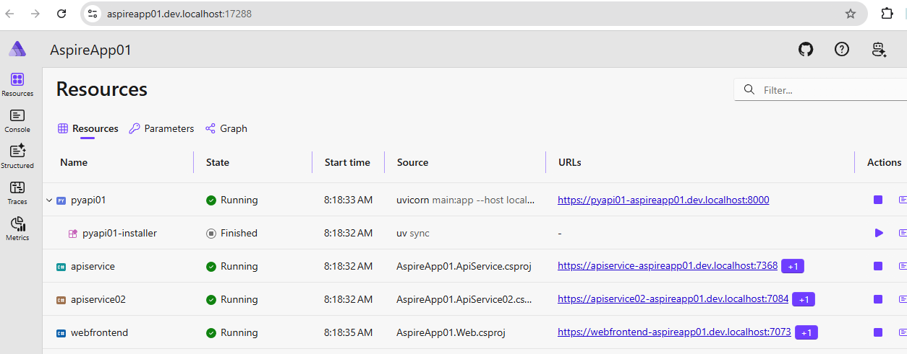

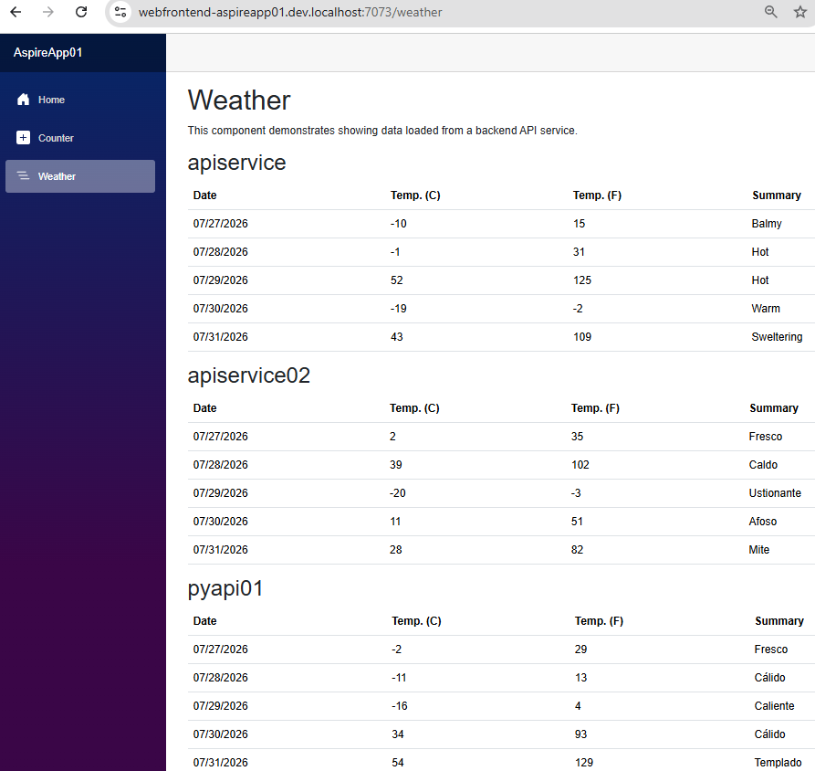

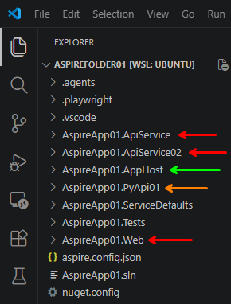

---

## Requirements

| Requirement | Verify |
|-------------|--------|
| .NET SDK + Aspire CLI | `aspire --version` → `13.4.6+87fe259e4fc244c599019a7b1304c85a1488f248` |
| Azure CLI installed and working | you should be logged in via `az login` |
| Docker active | `docker --version` → `Docker version 29.5.2, build 79eb04c` |
| `uv` installed (for Python projects) | `uv --version` → `uv 0.11.7 (x86_64-unknown-linux-gnu)` |
| Dashboard check | open the dashboard and verify all resources are Running/Healthy and the frontend receives data |

---

## Docker or Azure Container Apps (ACA)?

These are two different deploy targets, and each integration teaches the AppHost how to
"translate" our Aspire model into artifacts for that target.

| Integration | Command | What to add in `AppHost.cs` | IaC generated | What it adds | Where you deploy |
|-------------|---------|-----------------------------|---------------|--------------|------------------|
| `Aspire.Hosting.Docker` | `aspire add docker` | `builder.AddDockerComposeEnvironment("env");` | `docker-compose.yaml` | Publisher for Docker Compose | Locally (or any host with Docker) |
| `Aspire.Hosting.Azure.AppContainers` | `aspire add azure-appcontainers` | `builder.AddAzureContainerAppEnvironment("env");` | Bicep for Azure Container Apps | Support for Azure Container Apps (ACA) | On Azure: generates the infrastructure (Bicep) and deploys to ACA |

So:

- **Docker** → intended for a local/self‑hosted deploy. With `aspire publish` it produces
  the `docker-compose.yaml` with your services' containers, which you then start with
  `docker compose up`.
- **azure-appcontainers** → this is the one that "thinks about deploying to ACA": it
  describes how to map your projects onto Container Apps and generates the necessary IaC.
  The actual deploy is then done with `azd` (Azure Developer CLI) or `aspire deploy`.

---

# Deploy to a local Docker environment

*This is **Step E** of the A → F journey.*

## Add the Docker package to the AppHost


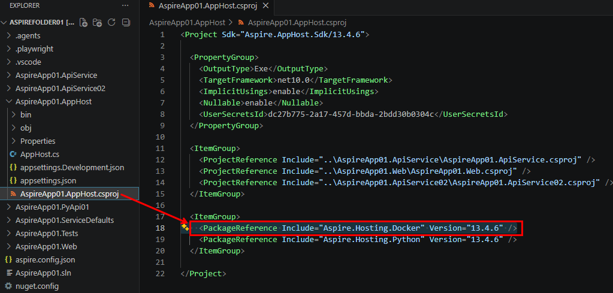

The result on the `.csproj` would be the same as `dotnet add package` (it adds the
`PackageReference`). But there are a couple of practical differences in favor of
`aspire add`:

| | **`aspire add docker`** | **`dotnet add package …`** |
|---|---|---|
| Name to know | short, friendly name (`docker`) | exact full package name (`Aspire.Hosting.Docker`) |
| Version | automatically picks the one compatible with your Aspire version | takes the latest available (you may have to pin the version by hand) |
| Target project | figures out which is the AppHost on its own | you must be in the right folder or specify the project |

In short: they do the same thing at the core (add the NuGet package), but `aspire add` is
a convenient wrapper that saves you from remembering the full name and correct version.
That's why it's preferable for Aspire integrations.

**To remove the library:**

- (a) delete the line from the file by hand, or
- (b) `dotnet remove package Aspire.Hosting.Docker`

Both remove the reference; then a `dotnet restore`/`build` fixes everything up — **but in
the correct folder**.

## The Docker Compose compute environment

Adding the Docker package to the AppHost is not enough on its own: we need a **compute
environment** that tells Aspire "publish to Docker Compose". Without the compute
environment, `aspire deploy` will do nothing.

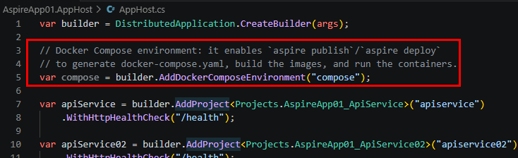

To do this we register a **Docker Compose environment** in the AppHost code, with:

```csharp
var compose = builder.AddDockerComposeEnvironment("compose");
```

which causes all resources to be automatically published as Compose services.

## Clean up the Docker environment (if needed)

> ⚠️ **Warning!** These two commands delete **all** Docker containers (running or
> stopped) and **all** images (in use or not).

```bash
for id in $(docker images -aq); do docker rmi -f "$id"; done
for id in $(docker ps -aq); do docker rm -f "$id"; done
```

## Run `aspire deploy` against local Docker

Now that `AddDockerComposeEnvironment("compose")` is present, the `aspire deploy` command:

- (a) produces the folder `./AspireApp01.AppHost/aspire-output/`,
- (b) creates in it the `.env` file with the variables associated with the services, all
  **unset**,
- (c) creates in it the `.env.Production` file with the same variables, already **set**,
- (d) runs `docker compose up -d --remove-orphans`, creating the containers locally.

```bash
aspire deploy
```


The build/publish pipeline creates a Docker Compose resource for each service
(`compose-dashboard`, `apiservice`, `apiservice02`, `pyapi01`, `webfrontend`), writes the
compose file, builds and tags one image per service, and finally runs Compose. The
generated files are:

**`./AspireApp01.AppHost/aspire-output/docker-compose.yaml`** (reconstructed):

```yaml
services:
  compose-dashboard:
    image: "mcr.microsoft.com/dotnet/nightly/aspire-dashboard:latest"
    ports:
      - "18888"
    expose:
      - "18889"
      - "18890"
    networks:
      - "aspire"
    restart: "always"

  apiservice:
    image: "${APISERVICE_IMAGE}"
    environment:
      OTEL_DOTNET_EXPERIMENTAL_OTLP_RETRY: "in_memory"
      ASPNETCORE_FORWARDEDHEADERS_ENABLED: "true"
      HTTP_PORTS: "${APISERVICE_PORT}"
      OTEL_EXPORTER_OTLP_ENDPOINT: "http://compose-dashboard:18889"
      OTEL_EXPORTER_OTLP_PROTOCOL: "grpc"
      OTEL_SERVICE_NAME: "apiservice"
    expose:
      - "${APISERVICE_PORT}"
    networks:
      - "aspire"

  apiservice02:
    image: "${APISERVICE02_IMAGE}"
    environment:
      OTEL_DOTNET_EXPERIMENTAL_OTLP_RETRY: "in_memory"
      ASPNETCORE_FORWARDEDHEADERS_ENABLED: "true"
      HTTP_PORTS: "${APISERVICE02_PORT}"
      OTEL_EXPORTER_OTLP_ENDPOINT: "http://compose-dashboard:18889"
      OTEL_EXPORTER_OTLP_PROTOCOL: "grpc"
      OTEL_SERVICE_NAME: "apiservice02"
    expose:
      - "${APISERVICE02_PORT}"
    networks:
      - "aspire"

  pyapi01:
    image: "${PYAPI01_IMAGE}"
    command:
      - "main:app"
      - "--host"
      - "0.0.0.0"
      - "--port"
      - "8000"
    environment:
      OTEL_TRACES_EXPORTER: "otlp"
      OTEL_LOGS_EXPORTER: "otlp"
      OTEL_METRICS_EXPORTER: "otlp"
      OTEL_PYTHON_LOGGING_AUTO_INSTRUMENTATION_ENABLED: "true"
      PORT: "8000"
      OTEL_EXPORTER_OTLP_ENDPOINT: "http://compose-dashboard:18889"
      OTEL_EXPORTER_OTLP_PROTOCOL: "grpc"
      OTEL_SERVICE_NAME: "pyapi01"
    expose:
      - "8000"
    networks:
      - "aspire"

  webfrontend:
    image: "${WEBFRONTEND_IMAGE}"
    environment:
      OTEL_DOTNET_EXPERIMENTAL_OTLP_RETRY: "in_memory"
      ASPNETCORE_FORWARDEDHEADERS_ENABLED: "true"
      HTTP_PORTS: "${WEBFRONTEND_PORT}"
      APISERVICE_HTTP: "http://apiservice:${APISERVICE_PORT}"
      services__apiservice__http__0: "http://apiservice:${APISERVICE_PORT}"
      APISERVICE_HTTPS: "https://apiservice:${APISERVICE_PORT}"
      APISERVICE02_HTTP: "http://apiservice02:${APISERVICE02_PORT}"
      services__apiservice02__http__0: "http://apiservice02:${APISERVICE02_PORT}"
      APISERVICE02_HTTPS: "https://apiservice02:${APISERVICE02_PORT}"
      PYAPI01_HTTP: "http://pyapi01:8000"
      services__pyapi01__http__0: "http://pyapi01:8000"
      OTEL_EXPORTER_OTLP_ENDPOINT: "http://compose-dashboard:18889"
      OTEL_EXPORTER_OTLP_PROTOCOL: "grpc"
      OTEL_SERVICE_NAME: "webfrontend"
    ports:
      - "${WEBFRONTEND_PORT}"
    depends_on:
      apiservice:
        condition: "service_started"
      apiservice02:
        condition: "service_started"
      pyapi01:
        condition: "service_started"
    networks:
      - "aspire"

networks:
  aspire:
    driver: "bridge"
```

**`./AspireApp01.AppHost/aspire-output/env`** — variables present but **unset** (a
template):

```dotenv
# Container image name for apiservice
APISERVICE_IMAGE=
# Default container port for apiservice
APISERVICE_PORT=
# Container image name for apiservice02
APISERVICE02_IMAGE=
APISERVICE02_PORT=
# Container image name for pyapi01
PYAPI01_IMAGE=
# Container image name for webfrontend
WEBFRONTEND_IMAGE=
WEBFRONTEND_PORT=
```

**`./AspireApp01.AppHost/aspire-output/env.Production`** — same variables, **set**:

```dotenv
APISERVICE_IMAGE=apiservice:aspire-deploy-20260726095356
APISERVICE_PORT=8080
APISERVICE02_IMAGE=apiservice02:aspire-deploy-20260726095356
APISERVICE02_PORT=8080
PYAPI01_IMAGE=pyapi01:aspire-deploy-20260726095356
WEBFRONTEND_IMAGE=webfrontend:aspire-deploy-20260726095356
WEBFRONTEND_PORT=8080
```

The pipeline finishes with a summary (abridged):

```text
--------------------------------------------------------------------
✅ 31/31 steps succeeded • Total time: 27.63s
✅ Pipeline succeeded
apiservice:        No public endpoints
pyapi01:           No public endpoints
apiservice02:      No public endpoints
webfrontend:       http://localhost:32769
compose-dashboard: http://localhost:32768
--------------------------------------------------------------------
```

## What we get after the deploy

Listing the images shows **two entries for each** service — two tags pointing to the same
image, as is normal in Docker:

```text
$ docker images -a
   IMAGE                                                      IMAGE ID       DISK USAGE  CONTENT SIZE
1. apiservice02:aspire-deploy-20260726095356                 e6505fde23f4   344MB       97MB
2. apiservice02:latest                                       e6505fde23f4   344MB       97MB
3. apiservice:aspire-deploy-20260726095356                   55a7781889f3   344MB       97MB
4. apiservice:latest                                         55a7781889f3   344MB       97MB
5. mcr.microsoft.com/dotnet/nightly/aspire-dashboard:latest  187fe35d9ebe   317MB       88.4MB
6. pyapi01:aspire-deploy-20260726095356                      ce9c6c90f240   331MB       76.1MB
7. pyapi01:ee9766a2149b689b6fed0c1574b99797ac0377d2          ce9c6c90f240   331MB       76.1MB
8. webfrontend:aspire-deploy-20260726095356                  140916377ea0   360MB       101MB
9. webfrontend:latest                                        140916377ea0   360MB       101MB
```

Why two entries?

- `...20260726095356` → an immutable tag tied to this specific deploy (useful for
  rollback / traceability);
- `latest` → a convenient tag that always points to the latest build.

For the dashboard, a `docker-compose.yaml` and a dedicated container are created.

## Test it!

`aspire deploy` generated two links:

**Link 1 → `webfrontend`:** open <http://localhost:32769> in the browser and check the
Weather tab, which internally calls all the APIs available on the Docker network.

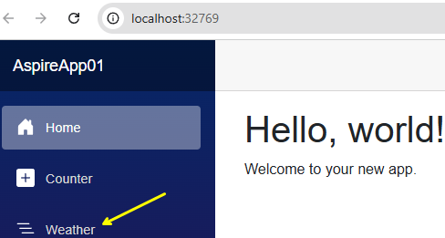

**Link 2 → `compose-dashboard`:** open the dashboard at <http://localhost:32768> to see
the state of the deployed containers. It asks for a **token**! We retrieve it by taking
the container name (via `docker ps`) and passing it to this command:

```bash
docker logs $(docker ps -q --filter ancestor=mcr.microsoft.com/dotnet/nightly/aspire-dashboard:latest) 2>&1 \
  | grep -oP 't=\K[0-9a-f]+'
```

```text
7d656a0d632a8d666f7f201203d0afe8
7d656a0d632a8d666f7f201203d0afe8
```

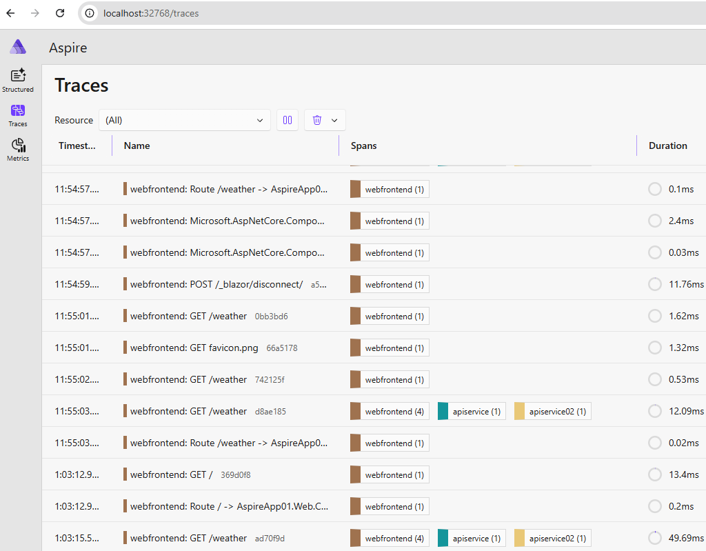

Once we enter the password in the dashboard, we get what is shown here:

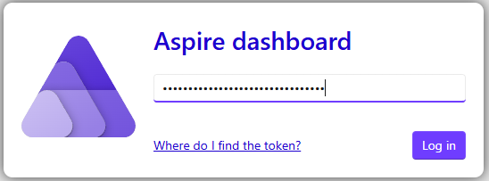

### Why is the "Resources" view missing?

The Aspire Dashboard has two "modes":

| Mode | How it runs | What it shows |
|------|-------------|---------------|
| Development (`aspire run` / F5) | The dashboard is connected to the AppHost (the orchestrator) | Resources (graph of the apps) + logs + traces + metrics |
| Deploy (Docker Compose / ACA) | The dashboard runs as a standalone container, without the AppHost | Only telemetry: logs, traces, metrics |

The Resources page only works when the dashboard can talk to the AppHost's resource
service, which tells it "there are apiservice and webfrontend, they are Running, etc.".
In the Compose deploy the AppHost is no longer there: it did its job (generate the
`docker-compose.yaml`) and then left the stage. The containers run on their own,
orchestrated by Docker, not by the AppHost. So the dashboard has no one to provide the
list of resources → the Resources tab is empty and sends you to the logs. It's the same
concept stated at the beginning: **the AppHost is a development/orchestration tool, not a
service that keeps running in production.**

### How to see the running applications

```bash
docker ps --format "table {{.Names}}\t{{.Status}}\t{{.Ports}}"
```

```text
NAMES                                          STATUS        PORTS
aspire-compose-5bb2b37e-webfrontend-1          Up 3 hours    0.0.0.0:32769->8080/tcp, [::]:32769->8080/tcp
aspire-compose-5bb2b37e-pyapi01-1              Up 3 hours    8000/tcp
aspire-compose-5bb2b37e-compose-dashboard-1    Up 3 hours    18889-18890/tcp, 0.0.0.0:32768->18888/tcp, [::]:32768->18888/tcp
aspire-compose-5bb2b37e-apiservice-1           Up 3 hours    8080/tcp
aspire-compose-5bb2b37e-apiservice02-1         Up 3 hours    8080/tcp
```

---

# Deploy to Azure Container Apps

*This is **Step F** of the A → F journey.*

## Compute environment: Azure Container Apps package

This is the command to add the Azure Container Apps package:

```bash
aspire add Aspire.Hosting.Azure.AppContainers
```

```text
✅ The package Aspire.Hosting.Azure.AppContainers::13.4.6 was added successfully.
```

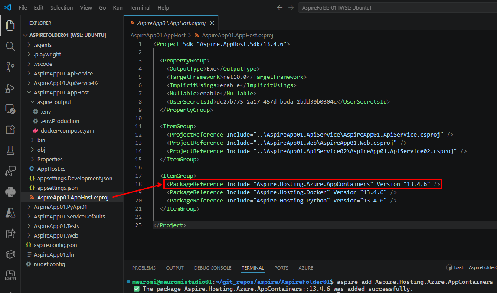

The result on the `.csproj` would be the same as `dotnet add package` (it adds the
`PackageReference`):

```xml
<ItemGroup>
  <PackageReference Include="Aspire.Hosting.Azure.AppContainers" Version="13.4.6" />
  <PackageReference Include="Aspire.Hosting.Docker" Version="13.4.6" />
  <PackageReference Include="Aspire.Hosting.Python" Version="13.4.6" />
</ItemGroup>
```

As before, `aspire add` picks a compatible version automatically and finds the AppHost on
its own, which is why it is preferable for Aspire integrations. To remove the library:
delete the line by hand, or `dotnet remove package Aspire.Hosting.Docker` — then a
`dotnet restore`/`build` in the correct folder fixes everything up.

## The Container App compute environment

Adding the Azure Container Apps package to the AppHost is not enough on its own: we need a
**compute environment** that tells Aspire "**publish to Azure Container Apps**". Without
the compute environment, `aspire deploy` will do nothing.

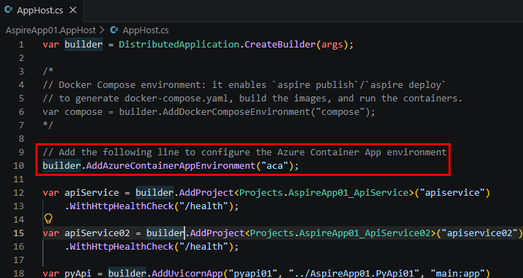

To do this we register an **Azure Container App Environment** in the AppHost code, with:

```csharp
var aca = builder.AddAzureContainerAppEnvironment("aca");
```

which causes all resources to be automatically published as Azure Container Apps services.

## Is there capacity in the region? A light, fast probe

Azure does not warn us in advance, but we can get a quick answer through a **probe
environment**, instead of discovering it at the end of the deploy. Since capacity is only
discovered by actually trying to allocate, the smart move is to allocate the smallest,
fastest thing that uses the same path: a "bare" ACA environment, without your apps. It
takes ~1–2 minutes and uses the same AKS allocation that fails in the full deploy.

**Simple probe** (test availability in one specific region):

```bash
az group create -n probe-rg -l westeurope
az containerapp env create -n probe-env -g probe-rg -l westeurope
```

**Full probe** (test availability across multiple regions):

```bash
for R in westeurope northeurope swedencentral westus3 uksouth eastus2; do
  echo "=== Test $R ==="
  az containerapp env create -n probe-$R -g probe-rg-$R -l $R \
    && echo "✅ $R HAS CAPACITY" && break \
    || echo "❌ $R DOES NOT HAVE CAPACITY, I'M GOING TO TRY THE NEXT"
done
```

- If it **fails** → move to the next test.
- If it **succeeds** → that region has capacity. Delete the probe and launch the real
  deploy there. Remember to delete the whole resource group afterwards
  (`az group delete -n probe-rg`).

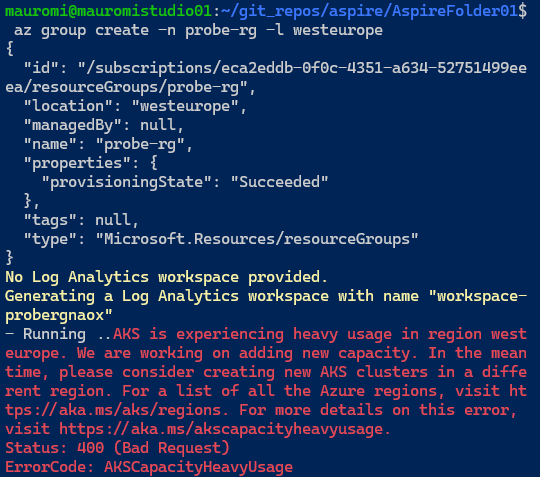

Example output of the simple probe:

```text
$ az group create -n probe-rg -l westeurope
{
  "id": "/subscriptions/<sub-id>/resourceGroups/probe-rg",
  "location": "westeurope",
  "name": "probe-rg",
  "properties": { "provisioningState": "Succeeded" },
  "type": "Microsoft.Resources/resourceGroups"
}

$ az containerapp env create -n probe-env -g probe-rg -l westeurope
No Log Analytics workspace provided.
Generating a Log Analytics workspace with name "workspace-proberggt05"
Container Apps environment created. To deploy a container app, use: az containerapp create --help
{
  "id": ".../Microsoft.App/managedEnvironments/probe-env",
  "location": "West Europe",
  "name": "probe-env",
  "properties": { ... },
  "resourceGroup": "probe-rg",
  "type": "Microsoft.App/managedEnvironments"
}
```

## Deploy to ACA

Define the three key variables and launch the deployment:

```bash
export Azure__SubscriptionId="<your-subscription-id>"
export Azure__Location="westeurope"
export Azure__ResourceGroup="rg-aspireappwe01"
aspire deploy
```

The deployment takes about 6 minutes. The pipeline builds the images, provisions an
Azure Container Registry (ACR), pushes the images, provisions the Container Apps
Environment and one Container App per service. Abridged, the meaningful lines are:

```text
🛠️ Building AppHost... AspireApp01.AppHost/AspireApp01.AppHost.csproj
(prepare-azure-container-apps-aca) [INF] HTTP endpoints will use HTTPS (port 443) in
    Azure Container Apps: apiservice:http, apiservice02:http, pyapi01:http, webfrontend:http.
    To opt out, use .WithHttpsUpgrade(false) on the container app environment.
(create-provisioning-context) [INF] Creating resource group rg-aspireappwe01 in westeurope...
(provision-aca-acr)  ✓ Successfully provisioned aca-acr (16.9s)
(login-to-acr-aca-acr) [INF] Docker login to acaacr5tmzapu5vzhcu.azurecr.io succeeded.
(push-apiservice)   ✓ Successfully pushed apiservice   → acaacr5tmzapu5vzhcu.azurecr.io (22.2s)
(push-apiservice02) ✓ Successfully pushed apiservice02 → acaacr5tmzapu5vzhcu.azurecr.io (21.3s)
(push-webfrontend)  ✓ Successfully pushed webfrontend  → acaacr5tmzapu5vzhcu.azurecr.io (21.7s)
(push-pyapi01)      ✓ Successfully pushed pyapi01      → acaacr5tmzapu5vzhcu.azurecr.io (21.9s)
(provision-aca)     ✓ Successfully provisioned aca (236.9s)
(provision-apiservice-containerapp)   ✓ (42.9s)
(provision-webfrontend-containerapp)  ✓ (44.1s)  → https://webfrontend.ambitiousforest-cd46575a.westeurope.azurecontainerapps.io
(provision-apiservice02-containerapp) ✓ (44.5s)
(provision-pyapi01-containerapp)      ✓ (77.0s)
Dashboard available at https://aspire-dashboard.ext.ambitiousforest-cd46575a.westeurope.azurecontainerapps.io
```

Final summary:

```text
--------------------------------------------------------------------
✅ 36/36 steps succeeded • Total time: 5m 49s
✅ Pipeline succeeded
☁️ Target: Azure
📦 Resource Group: rg-aspireappwe01
🔑 Subscription: <your-subscription-id>
🌐 Location: westeurope
apiservice:    No public endpoints (Azure Portal)
webfrontend:   https://webfrontend.ambitiousforest-cd46575a.westeurope.azurecontainerapps.io (Azure Portal)
apiservice02:  No public endpoints (Azure Portal)
pyapi01:       No public endpoints (Azure Portal)
📊 Dashboard:  https://aspire-dashboard.ext.ambitiousforest-cd46575a.westeurope.azurecontainerapps.io
--------------------------------------------------------------------
```

From the deploy output we get the `webfrontend` — reachable at the Application URL of the
frontend Container App inside the Container Apps Environment:

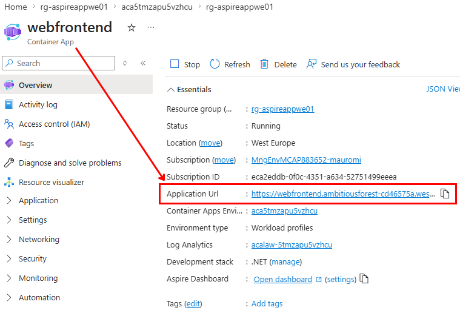

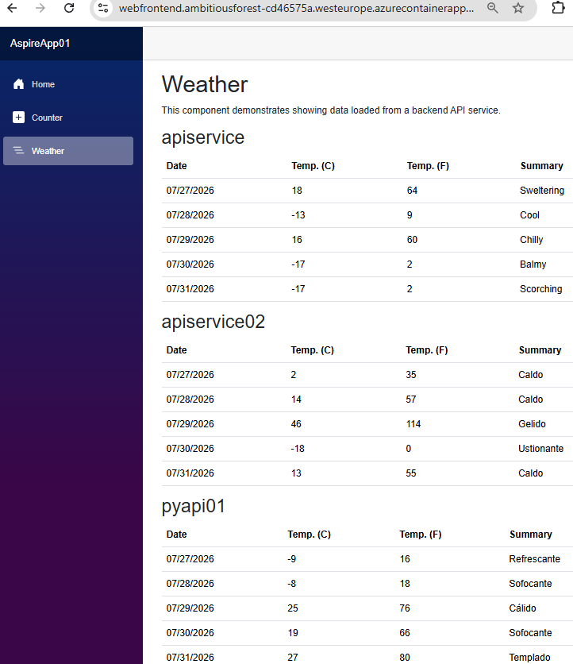

…and the dashboard:

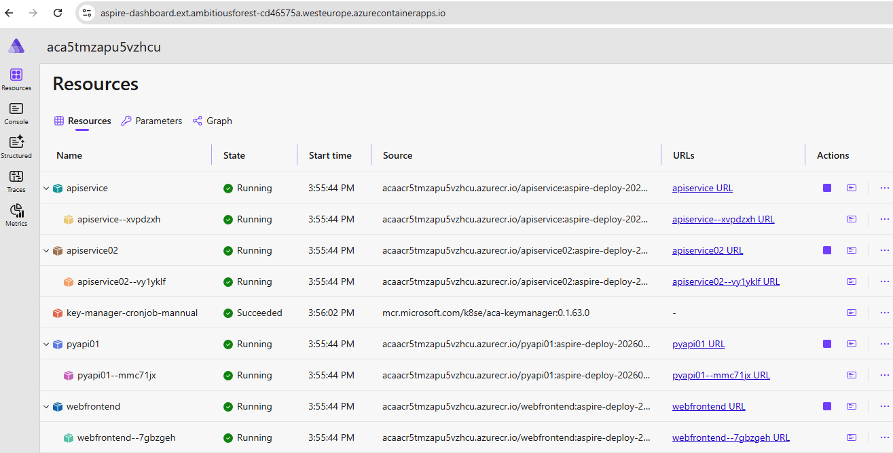

> **Note:** Aspire stores the provisioning configuration — not in environment variables,
> but in `~/.aspire/deployments/<hash>/production.json` (so "above" the project folder,
> right in the user's home directory). From there it re‑reads the resource group,
> ignoring our environment variables. (That hash `5BB2B37E…` is the same prefix as the
> `aspire-env-5bb2b37e-…` containers from earlier.)

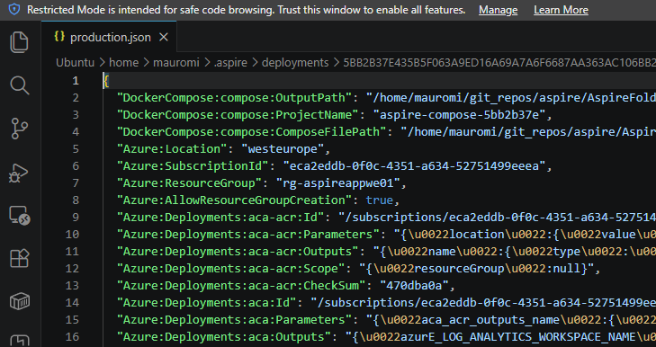

## Result on Azure

- **Resource group:** 5 resources + 4 Container Apps inside the Container Apps Environment.

  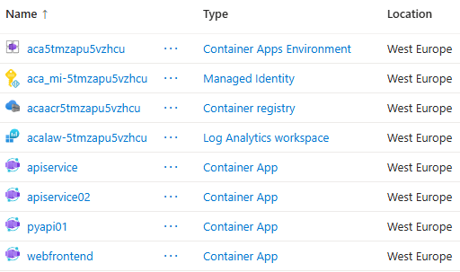

- **Container Apps Environment with 4 Container Apps:** 1 frontend + 3 APIs (2 ASP.NET +
  1 Python).

  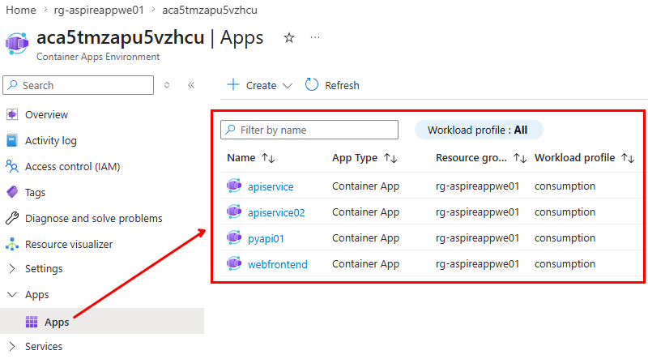

- **Container Registry with 4 repositories** (each with one Docker image initially).

  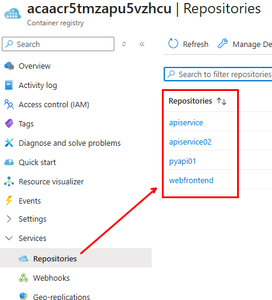

- The frontend Container App is at
  `https://webfrontend.ambitiousforest-cd46575a.westeurope.azurecontainerapps.io`.

## A couple of important clarifications

1. **They are not mutually exclusive:** you can have both integrations at the same time
   and choose the target at publish/deploy time. They are additional "publishers", not
   exclusive alternatives.
2. **Docker is needed for ACA too:** ACA runs containers, so in both cases your apps get
   containerized. The difference is *where* and *how* they are orchestrated (Compose
   locally vs managed ACA on Azure).
3. **For ACA on Azure** you will still need `azd` and a configured Azure
   account/subscription.

---

## Related useful commands

- `aspire publish` → generates only the artifacts (compose + `.env`) without building
  images or starting containers (useful to inspect the output).
- `aspire destroy` → stops and removes the containers/networks/volumes created (for
  cleanup).
- `aspire doctor` → shows which container runtime it detected (Docker/Podman).

**To verify the resources created in the resource group:**

```bash
echo "=== Resources within rg-aspireapp01 resource group ==="
az resource list -g rg-aspireapp01 --query "[].{Name:name, Type:type}" -o table 2>&1

echo ""
echo "=== Container Apps and their public URL (FQDN) ==="
az containerapp list -g rg-aspireapp01 \
  --query "[].{Name:name, FQDN:properties.configuration.ingress.fqdn, External:properties.configuration.ingress.external, Running:properties.runningStatus}" -o table 2>&1
```

**To verify the ACR / environment state:**

```bash
az containerapp env show -n envecf6pfrrswzpk -g rg-aspireapp01 \
  --query "properties.provisioningState" -o tsv
```

### 🔍 Why it works even though the Python project has "many files"

Aspire does **not** look at the folder contents. Aspire only looks at:

- the project name (`AspireApp01.PyApi01`),
- the Dockerfile,
- the exposed port,
- the health check.

Everything else (venv, `uv.lock`, `.env`, etc.) **does not matter**. The Dockerfile
decides **which files to copy**:

```dockerfile
COPY main.py .
COPY monitoring.py .
COPY favicon.ico .
```

So Aspire containerizes **only what we decided**.

---

🎉 **That completes the journey (A → F):** from an empty machine to a multi‑language
Aspire solution running locally, on Docker Compose, and on Azure Container Apps.

[⬅ Back to index](README.md) · [⬅ Previous: Integrate the Python app into Aspire](06-integrate-python-into-aspire.md)
